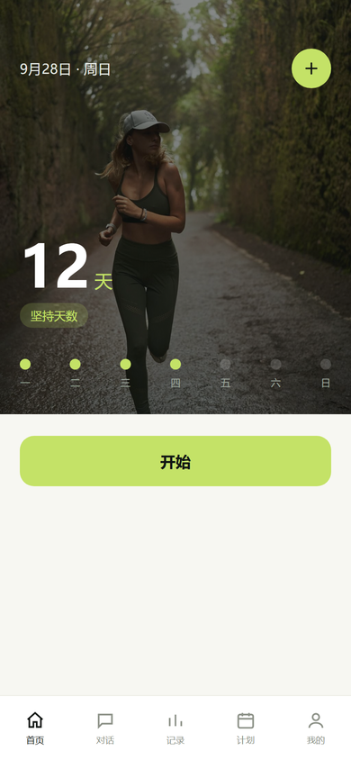
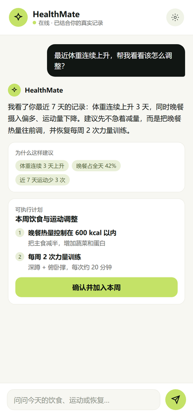
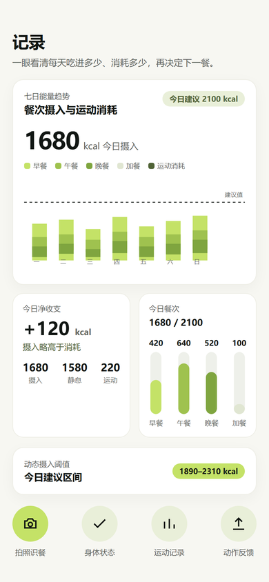
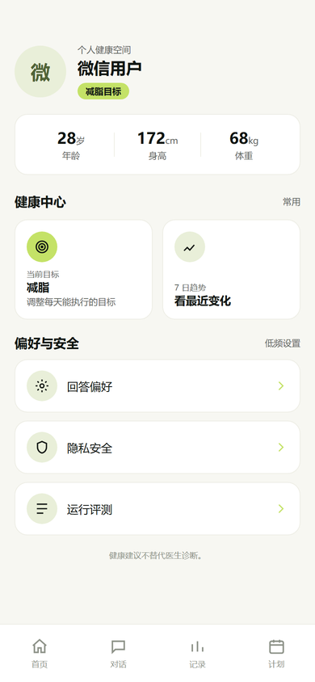

<p align="center">
  
</p>

<h1 align="center">HealthMate</h1>

<p align="center"><strong>面向个人健康管理的 Agent 工作台</strong></p>

<p align="center">
  <a href="#运行预览">运行预览</a> ·
  <a href="#能做什么">能做什么</a> ·
  <a href="#如何使用">如何使用</a> ·
  <a href="#安装与启动">安装与启动</a>
</p>

HealthMate 是一个由 Health Agent Harness 驱动的个人健康工作台。它把饮食、运动、睡眠、
身体状态和健康计划注册为受控工具，让 Agent 能读取真实记录、调用工具、观察结果并持续调整；
所有写入和高风险操作仍由用户确认。

当前提供三位共享同一 Harness Kernel 的用户人格：小健负责自律训练，小康负责温和养生，
小管家负责整合记录与组织计划。请求进入内核后由 Router Agent 分派给领域子 Agent，
再由 Decision Agent 仲裁为唯一答复；人格层与领域能力层彼此独立。

## 运行预览

<table align="center">
  <tr>
    <td align="center"><br><sub>首页 · 坚持打卡</sub></td>
    <td align="center"><br><sub>对话 · 智能问答</sub></td>
    <td align="center"><br><sub>记录 · 能量收支</sub></td>
    <td align="center"><br><sub>我的 · 健康档案</sub></td>
  </tr>
</table>

## 能做什么

| 功能 | 说明 |
| --- | --- |
| 拍照识餐 | 拍下餐食，自动估算热量并记入当天 |
| 记录运动 | 记录训练和身体状态，跟踪每天消耗 |
| 能量仪表盘 | 一眼看清每天吃进多少、消耗多少 |
| 三位健康 Agent | 小健督促训练、小康关注养生、小管家组织计划 |
| Multi-Agent Harness | Router 分派领域子 Agent，Decision 仲裁结果；每个 Agent 仅能调用授权工具 |
| 语音聊天 | 小健与小康支持语音输入和语音播报，文字模式始终可用 |
| 设置中心 | 集中管理文字模型、语音 API、默认陪伴、隐私和健康目标 |
| 主动提醒 | 运动断档、睡眠不足、体重上升时主动提醒你 |
| 目标与打卡 | 设定目标、每日打卡，看见坚持 |

## 如何使用

1. 在微信中打开 HealthMate 小程序，授权登录；
2. 完善健康档案：填写年龄、身高、体重，选择你的目标（减脂 / 保持 / 增肌）；
3. 吃饭时拍照识餐，运动后随手记录；
4. 在「记录」页查看能量收支和七日趋势；
5. 在「助手」页选择小健、小康或小管家，通过文字或语音交流；
6. 跟着建议慢慢调整，别忘了打卡坚持。

## 安装与启动

本项目由三部分组成：微信小程序、后端服务（FastAPI）、可选的本地 AI 识别 Worker。
本地运行需要 Python 3.12、Node.js 和微信开发者工具。

Harness Kernel 的边界、多 Agent 协议、ReAct 子循环与语音配置见
[`docs/HEALTH_AGENT_HARNESS.md`](docs/HEALTH_AGENT_HARNESS.md)。

**1. 启动后端**

```powershell
git clone https://github.com/hauyer/health-assistant.git
cd health-assistant/backend
py -3.12 -m venv .venv
.\.venv\Scripts\Activate.ps1
pip install -r requirements-dev.txt
Copy-Item .env.example .env
python -m alembic upgrade head
python -m uvicorn app.main:app --host 0.0.0.0 --port 8000
```

本地开发默认用 SQLite，在 `.env` 中填 `ENV=development`、`DATABASE_URL=sqlite:///./healthmate.db`。

**2. 打开小程序**

用微信开发者工具导入仓库根目录（`project.config.json` 已指向 `miniprogram/`），填入你的 AppID，
并在 `miniprogram/config/index.js` 中配置后端地址。

**3. 部署上线**

生产环境通过微信云托管部署，构建目录为 `backend/`；完整部署与本地 AI Worker 配置见 `docs/` 目录。

> 健康建议不替代医生诊断。
