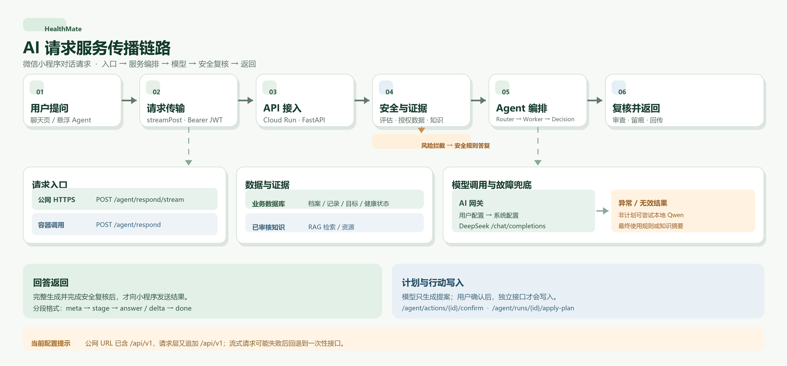

# HealthMate AI 对话请求服务链路

> 范围：微信小程序聊天页和悬浮 Agent 发起的文字问答。图片识餐、视频动作分析使用独立的异步任务链路，不经过这里的 `/agent/respond` 编排。



```mermaid
flowchart TD
    U[用户输入健康问题] --> MP[微信小程序<br/>聊天页 / 悬浮 Agent]
    MP --> REQ[request.js · streamPost<br/>附带 Bearer JWT]
    REQ --> TRANS{可用分块响应？}
    TRANS -->|是：公网 HTTPS| STREAM[POST /api/v1/agent/respond/stream]
    TRANS -->|否：Cloud Run 容器调用| SINGLE[POST /api/v1/agent/respond<br/>一次性响应]
    STREAM -.失败且尚未显示答复.-> SINGLE

    STREAM --> API[FastAPI · 请求 ID / 限流 / JWT 鉴权]
    SINGLE --> API
    API --> RUN[Agent Orchestrator · respond<br/>创建运行记录和阶段记录]
    RUN --> SAFE{输入安全评估}
    SAFE -->|拦截| SAFE_REPLY[安全规则答复<br/>不调用模型]
    SAFE -->|放行| PREP[读取健康上下文 + 检索已审核知识<br/>能力授权控制数据范围]

    PREP -.-> DATA[(业务数据库<br/>档案 / 记录 / 目标 / 状态 / 运行轨迹)]
    PREP -.-> RAG[(知识检索<br/>审核文档 / 资源)]
    PREP --> ROUTE{意图路由}
    ROUTE -->|明确的单领域| WORKER[领域 Worker<br/>计划 / 运动 / 饮食 / 恢复 / 记录 / 通用]
    ROUTE -->|跨领域或不明确| LLM_ROUTE[模型 Router<br/>选择 1～3 个 Worker]
    LLM_ROUTE --> WORKER
    WORKER --> DECIDE[Decision 阶段<br/>整合证据、冲突与行动提案]
    DECIDE --> CHECK[计划约束 / 内容清理 / 输出安全复核<br/>补充已审核资源]

    ROUTE -.模型调用.-> GATE
    WORKER -.模型调用.-> GATE
    DECIDE -.按需调用.-> GATE
    GATE[AI Gateway<br/>优先用户配置，其次系统配置] --> CLOUD[DeepSeek 兼容接口<br/>/chat/completions]
    DECIDE -->|异常或无效结果| FALLBACK[兜底处理<br/>异常且非计划时可尝试本地 Qwen<br/>最终使用规则或知识摘要]
    FALLBACK --> CHECK

    SAFE_REPLY --> SAVE[保存结果、阶段轨迹与指标]
    CHECK --> SAVE
    SAVE -.-> DATA
    SAVE --> RESP{返回方式}
    RESP -->|stream| NDJSON[NDJSON：meta → stage → answer / delta → done<br/>在生成与安全复核完成后发送]
    RESP -->|single| JSON[完整 JSON 答复]
    NDJSON --> MP
    JSON --> MP

    MP -.用户确认计划或行动.-> CONFIRM[独立确认接口<br/>/agent/actions/{id}/confirm<br/>或 /agent/runs/{id}/apply-plan]
    CONFIRM -.确认后才写入.-> DATA
```

## 读图要点

1. 设计上的分块路径是小程序通过公网 HTTPS 请求 Cloud Run 上的 FastAPI；分块不可用，或请求失败且尚未显示答复时，改用 `wx.cloud.callContainer` 请求一次性接口。
2. 数据库读取和知识检索发生在模型推理前，受能力授权约束。明确的单领域请求可以跳过模型 Router；跨领域或不明确的请求可能经过 Router 和多个 Worker。
3. 模型网关优先使用用户启用的配置，否则使用系统 DeepSeek 配置。发生异常且不是计划请求时，编排层可以尝试本地 Qwen；没有可用答复时走规则或已审核知识摘要。计划请求的兜底为规则计划。
4. `/respond/stream` 先执行完整 `respond()`，再发送 NDJSON 事件。`stage` 是已记录的处理阶段，`answer` 和 `delta` 是完成安全复核后的展示内容，不代表上游模型实时吐词。
5. 模型提出的计划或行动不会自动写入健康记录；用户通过独立确认接口触发写入。

**当前配置注意：**`miniprogram/config/index.js` 的 `PUBLIC_API_BASE_URL` 已以 `/api/v1` 结尾，而 `miniprogram/utils/request.js` 的 `streamPost()` 又拼接一次 `/api/v1`。因此当前公网分块请求会指向 `/api/v1/api/v1/agent/respond/stream`；若服务端没有额外路径改写，它会失败并进入一次性接口回退。图中标的是后端实际注册的正确接口路径。

## 对应实现

- 小程序入口：`miniprogram/pages/chat/index.js`、`miniprogram/components/agent-float/index.js`
- 请求与传输：`miniprogram/utils/request.js`、`miniprogram/config/index.js`
- API 与鉴权：`backend/app/api/v1/agent.py`、`backend/app/api/deps.py`、`backend/app/main.py`
- 编排与阶段记录：`backend/app/services/agent/orchestrator.py`、`backend/app/services/agent/run_stages.py`
- 路由与 Worker：`backend/app/harness/collaboration.py`、`backend/app/harness/kernel.py`
- 模型网关、上下文与知识：`backend/app/services/ai/gateway.py`、`backend/app/services/agent/tools.py`、`backend/app/services/rag/service.py`
