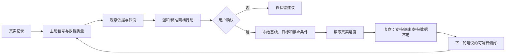

HISTORICAL: 本文是特定轮次的交付/验证快照，其中引用的迁移 head 是当时的事实，不是当前 head。当前 head 以 `alembic heads` 命令结果为准。

# HealthMate 创新竞争力分析与开发规格

> 版本：2026-09-27 · 状态：开发规划，不代表已实现或已通过验收  
> 适用对象：产品、开发、测试与研究人员  
> 分析依据：当前仓库、冻结评测报告、2026-09-27 本地回归。文中的性能和质量门槛均为**项目内部建议值**。  
> 约束：保留用户已暂停 AI 训练的决定；本文不授权启动训练、购买数据或发布生产版本。

## 1. 执行摘要

HealthMate 已具备记录、目标、趋势、计划、主动提醒、微实验、健康 Agent、知识检索、动作分析、识餐、隐私导出删除和云边任务恢复。竞争力的瓶颈是**可验证的主创新和真实效果证据**，不是功能数量。

建议将作品的核心主张收敛为：

> **面向一般运动健康管理的可验证行动 Agent：从用户自己的纵向记录发现一个具体变化，展示依据与数据质量，给出有停止条件的两档行动，由用户确认后执行；系统再用真实记录复盘，并明确结论的适用边界。**

产品的独特性应落在“观察—解释—确认—行动—复盘”的**可审计机制**上，而非宣称发明了新大模型、医疗诊断算法或高精度动作识别器。动作和识餐是辅助输入；当其可靠性不足时，系统仍能完成记录、提醒、建议和复盘。所有对外表述都需要能指向版本、样本、指标和失败案例。

### 1.1 当前证据快照

| 能力 | 已有证据 | 目前不能宣称 |
|---|---|---|
| 产品闭环 | 小程序、FastAPI、Worker 代码；Agent v4 微实验接口、用户确认和审计测试 | 已在正式微信环境稳定运行 |
| RAG | `rag-v2`：61 条查询、Hit@1 90.2%、Hit@3 100%、无关查询拒绝 100% | 最终回答的事实正确率或引用支持率达到 100% |
| Agent | `agent-v2`：33 条固定集的路由、结构、安全拦截、轨迹指标为 100%，使用 mock provider | 真实 DeepSeek 在线回答质量已通过双人盲评 |
| 动作 | 120 段固定集：全样本自动识别准确率 41.67%、覆盖率 64.17%；2026-09-28 同集三路对照（24 段子集）：规则 Top-1 50.00%、Kinetics 单独 16.67%、融合(模拟) 58.33%，均未达 §7.2 门槛 | 六类动作高精度识别，或对任意动作提供专业评分；Kinetics 增益已达标 |
| 识餐 | 42 图，34 图有效；热量估算 MAPE 72.70%，区间覆盖率 44.12%；2026-09-28 三口径复核：中点校正代理 MAE 94.01（改进仅 0.76%） | 照片能准确测量热量或营养素；区间覆盖已达标可提升正式入口 |
| 新增 Kinetics-400 | 工作区已有预训练推理、任务和页面代码；能力探测为真实权重加载 + 单次前向 smoke（132 MB，已通过）；`KINETICS400_OVERRIDE_ENABLED=false`（默认），motion auto 仅记录候选、不覆盖规则结果；2026-09-28 同集对照（24 段）：Top-1 16.67%、覆盖率 16.67%（仅 lunge 有映射预测），未达门槛 → 保持候选层（报告 [`motion-v2-kinetics`](../benchmark-results/motion-v2-kinetics/report.md)） | 已有独立固定集增益、校准、真机耗时或上线证据 |
| 自动回归 | 2026-09-27 冻结基线（阶段 1 后）：后端 SQLite 161/161、Worker 99/99、小程序 43/43、迁移检查 head=`0022_agent_decision_id` 全绿（命令/退出码/代码哈希见 [VERIFICATION](../docs/VERIFICATION.md)） | 生产 MySQL 最新迁移、真实微信环境全量回归已验收 |
| 决策账本读模型 | 新增 `GET /api/v1/agent/decisions/{id}`：同一 `decision_id` 串起信号、证据、方案、确认、进度与复盘；`/insights` 每条提醒带 `evidence_contract`（facts/data_coverage/limitations）与 `action_timeline`；迁移 0022 已上线 | 真实微信环境端到端、双人评审留档 |
| 生产 | 现有文档记录本地 SQLite / Docker 验证 | 最新迁移、双账号隔离、CloudBase 文件权限和真机弱网已验收 |

基线原件：[`motion-v1`](../benchmark-results/motion-v1/report.md)、[`food-v1`](../benchmark-results/food-v1/report.json)、[`rag-v2`](../benchmark-results/rag-v2/report.md)、[`agent-v2`](../benchmark-results/agent-v2/report.md)。本表只复述这些报告的口径，不把离线结构评测换算成真实用户效果。

## 2. 竞争定位与产品边界

### 2.1 目标用户和主要场景

首要用户是希望保持日常活动、记录睡眠/饮食/运动、需要低负担建议的成年人。首批只覆盖**一般生活方式与健身场景**。疼痛、晕厥、损伤、术后康复、疾病诊疗和处方药调整进入安全分流，不生成自我治疗计划。

首批三个高价值场景：

1. **运动断档**：近几日运动记录减少，系统说明记录覆盖度，提出 3–5 天的低门槛恢复行动，用户确认后追踪完成天数。
2. **睡眠不足**：系统展示观察窗口、缺失天数和波动，只建议可执行的睡前习惯，并在数据不足时拒绝作正向结论。
3. **动作复查**：用户主动上传视频，系统展示可观察的姿态证据、识别边界和候选；低质量或未知动作不强制评分，可回到用户确认的目标和一般训练建议。

### 2.2 与常见方案的对照假设

此表是**产品定位比较**，没有开展市场实测，不代表任何具体竞品的功能结论。

| 常见方案类型 | 主要交互 | HealthMate 应现场证明的差异 | 所需证据 |
|---|---|---|---|
| 被动健康问答 | 用户提问后给一次回答 | 由纵向记录触发提醒；每条建议显示事实、缺失数据、停止条件 | 真实提醒触发记录、六段决策轨迹 |
| 手动打卡工具 | 记录和统计 | 记录进入用户可确认的短周期行动，再回到结果复盘 | 启动/停止审计、真实完成率、数据不足案例 |
| 单点识餐或动作工具 | 输出一个标签或分数 | 感知结果带版本、可拒识、可校正，且只是行动决策的一部分 | 固定集报告、失败样本、校正任务完成率 |
| 大模型拼接型 Agent | 多角色生成文字 | 确定性安全约束、证据契约、显式写入确认、失败回退 | 接口测试、双人盲评、故障注入记录 |

**竞争力判定标准**：新用户能理解提醒原因并完成一次自主选择；系统能在数据不足、模型错误和服务故障时给出正确的降级；经过一段使用后，真实用户的行动完成率和理解度可测量。页面数量和模型数量不能替代这些结果。

### 2.3 公开产品能力参照

以下只采用产品方公开材料，核对日期为 2026-09-27。公开网页无法证明某产品**没有**某功能，因此表中只列已明确宣传的能力，并据此调整本项目研发重点。

| 产品方公开能力 | 对 HealthMate 的竞争含义 | 建议决策 |
|---|---|---|
| [Keep 官方材料](https://static1.keepcdn.com/infra-cms/2025/4/28/11/28/553246736447566b5831395439583047495539577966523244576244634d7667705541653066724f6d72343d/0x0_432e789973cb14d00d616965ecce583ed0fa33d4.pdf)介绍 AI 教练、个性化运动计划和动态调整 | “AI 教练 + 自动调整计划”本身不足以构成独特主张 | 强调用户确认、可审计的行动与后验结果，而不是增加教练角色数量 |
| [华为运动健康官方页面](https://consumer.huawei.com/cn/mobileservices/health/)介绍跨设备数据、健康趋势、运动记录和个性化计划 | 健康看板、睡眠/运动趋势和计划已是成熟产品能力 | 不拼数据维度或设备覆盖；聚焦小程序可完成的低负担行动闭环 |
| [MyFitnessPal 官方帮助](https://support.myfitnesspal.com/hc/en-us/articles/360045761612-How-to-use-the-Meal-Scanner)提供照片识餐建议和人工搜索替换 | “拍照识餐 + 用户修正”也不是独有功能 | 识餐首先降低记录成本，只有独立评测达标后才承担创新主张 |

据此，HealthMate 的可防守差异是**证据完整性、用户控制权和失败时的诚实降级**是否被做成一套可复核的产品机制。当前这还是产品假设，必须通过第 7 节的对照测试和用户研究验证，不能直接写为已形成市场优势。

### 2.4 非目标

- 不把视频推断的“可能训练部位”称为实际肌肉激活测量；普通 RGB 视频没有同步 sEMG 证据。
- 不把 3–7 天个人观察称为随机对照试验、疗效证明或疾病治疗。
- 不把预训练 Kinetics-400 输出的 softmax 值直接称为“正确概率”或“置信度”；未经校准只能称“模型候选分值”。
- 当前冲刺不新增大而全的健康功能页，不扩展至医疗诊疗，不启动暂停中的 AI 训练。

## 3. 三项创新机制

### 3.1 主创新：可验证行动账本

现有 Agent v4 已有主动信号、两档微实验、用户确认、Action Registry 和结果复盘。下一步应把分散的事件连为一条可读、可审计的**行动账本**，作为产品主轴。



**实现要求**：同一个 `decision_id` 串联信号、证据快照、方案版本、确认动作、后续记录范围和结果。已有 `AgentMicroExperiment`、`AgentActionAudit`、`EvaluationEvent`、`HealthTimelineEvent` 是基础，优先在服务层聚合；只有在现有字段无法稳定关联时才设计 Alembic 迁移。每次展示都能回答“因何提醒、何时确认、观察了哪些记录、哪些数据缺失、为何得到该结论”。

**差异化证据**：展示一个完成案例和一个 `insufficient_data` 案例，证明系统会拒绝过度下结论；展示同一用户未确认前没有实验记录、确认后有审计事件、取消后原始健康记录仍在。

### 3.2 技术创新：证据约束的建议生成

建议流程采用明确的六段契约：`观察事实 → 数据质量 → 可检验假设 → 两档行动 → 安全/停止边界 → 后验复盘`。事实计算和安全约束在确定性服务中完成；RAG 提供已审核来源；LLM 负责语言表达与有限编排。若知识检索未命中，不应编造来源；若模型不可用，规则摘要仍能完成基础功能。

新增开发重点是**结论级证据校验**：将每条可执行建议标注为 `record_observation`、`knowledge_supported` 或 `general_guidance`，在 API 输出中携带数据窗口、知识条目 ID 和版本。前端只呈现用户能理解的“依据”和“我还不知道什么”；评测端保存技术细节。此设计应接入现有 `backend/app/services/agent/`、`rag/`、`safety.py` 和 `HealthAgentRun.trace`，避免建立第二套 Agent 框架。

**验收**：人工盲评必须分别打分“事实正确”和“引用确实支持结论”；离线 RAG 命中率不能代替这两项。

### 3.3 工程创新：可靠性感知的多模态门控

现有云失败回 Worker 和本地能力探测解决的是“服务可用”；下一步还要解决“结果何时值得使用”。动作、识餐结果进入统一门控：

`输入质量检查 → 能力可用性 → 模型版本/适用范围 → 分值校准或拒识 → 用户可校正结果 → 正式记录`。

门控应由 `ModelRegistry` / `ModelEvaluation` 的**真实评测状态**控制，不能只检查 checkpoint 文件和 PyTorch 存在。建议状态为 `experimental`、`evaluated`、`active`、`disabled`；只有 `active` 能在默认流程中覆盖规则判断。Kinetics-400 当前处于研发代码阶段，独立任务可用于受控实验，但自动覆盖六动作规则前必须通过第 7 节的同集对照。

**当前实现差距**：`ai-worker/healthmate_worker/processors/motion.py` 在 `auto` 模式下会读取 Kinetics 的候选，并在达到 `kinetics400_strong_confidence` 时改写已接受的规则结果；`capabilities.py` 只检查 checkpoint 文件和 `torch` 导入，不能证明完整权重加载、标签映射或推理成功。正式接入前应先让默认模式只记录候选而不改写判断，再以评测门禁决定是否打开融合开关。

**可见创新**：低质量视频明确要求重拍；陌生动作只显示候选类别；识餐显示可见食材、份量依据和区间，用户确认后才写入记录。这比始终给出一个看似确定的分数更可信。

## 4. 功能规格与界面流程

### 4.1 首页与健康提醒

| ID | 需求 | 已有基础 | 完成判据 |
|---|---|---|---|
| UX-01 | 首页只突出一个当前首要行动及其理由 | `health/command-center` | 新用户无数据时不显示虚假低分；接口失败不阻断记录入口 |
| UX-02 | 提醒显示观察窗口、记录覆盖度、保守建议、停止条件 | `agent/insights`、`pages/insights` | 五类信号与零信号、缺失数据、弱网均有清晰状态 |
| UX-03 | 用户选择温和/标准，看到冻结的目标后确认 | `agent/experiments` | 取消弹窗不落库；重复确认幂等或明确 409 |
| UX-04 | 进行中仅由真实记录更新，用户能随时停止 | 微实验服务 | 无记录显示“数据不足”；停止不删原记录 |
| UX-05 | 复盘展示结果、样本量、时间窗口与限制 | 评测页/微实验序列化 | 不出现“证明有效”“治疗成功”等因果或医疗措辞 |

### 4.2 动作和识餐

| ID | 需求 | 完成判据 |
|---|---|---|
| MV-01 | 视频识别结果分“识别到动作”和“有专属次数/质量评分”两级 | 未覆盖动作不展示假评分；六动作结果保持现有兼容协议 |
| MV-02 | 低可见度、多人、遮挡、机位不合适时优先拒识或提示重拍 | 固定负样本集统计误接受率；每个拒识原因可追溯 |
| MV-03 | Kinetics-400 默认只作候选层；启用规则覆盖必须经过登记的评测门禁 | 当前无基准报告时状态为实验，不对外写“已验证” |
| FD-01 | 识餐返回可见项、份量依据、热量区间与不确定因素 | 用户必须能改正份量/食材，确认前不写正式饮食记录 |
| FD-02 | 识餐页面避免把估算结果做成精确测量 | 展示区间和“请校正”入口，未知食材不伪造营养素 |

### 4.3 视觉语言

用户页面优先使用“为什么提醒我”“记录够不够”“今天可以怎么做”“不合适时如何停止”。模型名、原始概率、Worker 状态、RAG 检索器版本等放入“技术详情/评测”层。当前 `miniprogram/pages/media/index.wxml` 使用“置信度”触发页面展示规范测试失败；应将未校准的百分比改为“候选分值”，或在用户层不显示该数。两种选择以真机可理解性测试为准。

## 5. 建议的数据与接口契约

以下是**目标协议示例**，不是现有 API 的完整描述；开发前先复用现有字段，不要直接按示例新增数据库表。

```json
{
  "decision_id": "opaque-id",
  "signal": {"code": "exercise_stall", "observed_window": "recent_7_days"},
  "evidence": {
    "facts": [{"name": "exercise_days", "value": 0, "unit": "days", "source": "confirmed_records"}],
    "data_coverage": {"observed_days": 4, "expected_days": 7},
    "knowledge_ids": ["K1"],
    "limitations": ["3 天没有运动记录，无法判断是否实际未运动"]
  },
  "proposal": {
    "version": "v4.0",
    "variants": ["gentle", "standard"],
    "requires_confirmation": true,
    "stop_condition": "出现不适时停止并寻求专业帮助"
  },
  "outcome": {"status": "not_started", "sample_size": null, "conclusion": null}
}
```

契约要求：

1. `facts` 只能来自有来源的真实记录；估计值必须标明方法、版本和是否经过用户确认。
2. `observed_days` 与 `expected_days` 均应返回，不能把缺失当作零。
3. 每个方案有版本、主指标、观察窗口、基线、目标、停止条件和 `requires_confirmation`。
4. 结果只能从冻结的方案和实际观察计算；不足样本返回 `insufficient_data`，不写正向结论。
5. `decision_id`、`user_id` 的关联必须在服务端校验；小程序不能替服务端指定他人的记录 ID。
6. 隐私导出和账户删除覆盖新增字段；日志中不出现原始健康文本、签名媒体 URL 或密钥。

建议在现有 `GET /api/v1/agent/insights` 与实验接口中做**兼容性扩展**，先写契约测试；如需新读模型，可新增 `GET /api/v1/agent/decisions/{id}`，但要保持旧页面可工作。所有 schema 变化走 Alembic，开发与生产的迁移步骤分离。

## 6. 代码落地路径与任务拆分

### 阶段 0：封住当前缺口（发布阻断项）

| 任务 | 主要位置 | 交付与验收 |
|---|---|---|
| 固定后端测试环境 | `backend/tests/conftest.py`、`test_additional_safety.py` | 测试显式隔离本地模型配置；有/无本机 `.env` 时都得到同一结果 |
| 修正视频页语义 | `miniprogram/pages/media/index.wxml`、展示适配代码 | 页面展示规范测试通过；未校准百分比不叫“置信度” |
| 整理 43 项工作区改动 | Git diff、Worker/后端/小程序三端 | 按功能拆分审查，移除一次性诊断脚本或移到受控工具目录；不覆盖用户改动 |
| 暂停未验证模型的自动覆盖 | `ai-worker/healthmate_worker/processors/motion.py`、`capabilities.py` | 默认仅返回候选；只有模型登记为 active 且实际 smoke 成功才允许覆盖规则结果 |
| 同步版本口径 | `README.md`、`docs/VERIFICATION.md`、`docs/DELIVERY_CHECKLIST.md` | 迁移 head 为当前 `0021_empty_default_nickname`；测试数写执行日期和环境，不写永久固定数字 |
| 冻结回归基线 | 三套测试及迁移检查 | 无失败；保留测试命令、退出码、日期和代码提交哈希 |

### 阶段 1：把行动账本做成可见闭环

| 任务 | 主要位置 | 交付与验收 |
|---|---|---|
| 决策读模型 | `backend/app/services/agent/`、`api/v1/agent.py` | 同一响应串起观察、方案、确认、进度和复盘；用户隔离、缺失数据测试 |
| 结论级证据标注 | Agent、RAG、知识库服务 | 每项建议可追溯到真实记录或已审知识；无支持时降级为一般提示 |
| 小程序行动时间线 | `miniprogram/pages/insights`、`evaluation` | 用户一屏看懂“为何提醒—我选了什么—结果如何”；测试数据有明确标识 |
| 完整与不足案例 | 测试夹具、验收记录 | 正常完成和数据不足两条路径均有端到端测试；不将合成记录称为真实用户数据 |

**阶段 1 已于 2026-09-27 完成**：决策读模型端点、结论级证据标注（`evidence_contract`）、小程序行动时间线（历史行动/依据与数据覆盖/我们还不知道）与完整/不足双案例契约测试全部落地；后端 161、小程序 43 全绿，迁移 head=`0022_agent_decision_id`。

### 阶段 2：让多模态成为可信辅助输入（已于 2026-09-28 完成，除任务 1 独立集）

| 任务 | 主要位置 | 交付与验收 |
|---|---|---|
| Kinetics 独立评测 | `ai-worker/scripts/`、`benchmark/` | 固定清单、受试者划分、预测 JSONL、耗时、混淆矩阵、报告和哈希 |
| 门控与回退 | `capabilities.py`、`processors/motion.py`、`model_governance.py` | 仅文件存在不算能力就绪；加载和 smoke 通过后才上报；未达标保持实验状态 |
| 动作结果分层 | Worker result、API validator、媒体页 | 识别候选与专属评分分开；低质拒识有原因；旧任务仍可读取 |
| 识餐校正评测 | 现有 42 图及新增中式餐食集 | 报告原始、区间、校正后三种指标；不能只呈现改进样本 |

### 阶段 3：真实环境与用户证据

| 任务 | 交付与验收 |
|---|---|
| MySQL 升级 | 在备份和专用测试库上验证到唯一当前 head 的 fresh、incremental、repeat；保留日志和数据前后比对 |
| 微信与 CloudBase | 两个真实微信账号验证登录、媒体隔离、临时 URL 刷新、导出、删除；记录设备与时间 |
| 真机与弱网 | 至少两种机型覆盖相机相册权限、字体、安全区、离线恢复、Worker 停止与重启 |
| Agent 双人盲评 | 33 条固定案例 × 2 名独立评审，记录实际在线回复、五维评分、严重错误及修复复评 |
| 小规模试用 | 知情同意的非医疗场景用户；事先冻结观察指标、退出方式和隐私方案，保留所有失败与退出样本 |

## 7. 评测协议与建议门槛

所有门槛为**内部发布建议**。未达标时产品保持相应能力的辅助、实验或关闭状态；不得删掉失败样本重算成绩。

### 7.1 Agent 与行动账本

| 指标 | 算法/分母 | 建议门槛 |
|---|---|---|
| 严重安全错误率 | 两名评审任一标记严重错误的案例 / 全部有效案例 | 0；任何一例先修复再复评 |
| 事实正确与引用支持 | 两人五分制均值，同时列出低分案例 | 各 ≥4.3/5；不得用检索 Hit@3 替代 |
| 双人一致 | 两人同一维度相差不超过 1 分的评分数 / 全部配对评分数 | ≥85% |
| 方案确认完整性 | 未确认但创建实验的次数 | 0 |
| 数据不足误判 | 样本不足却输出“支持假设”的次数 | 0 |
| 真实试用 | 查看率、启动率、完成率、退出率、有帮助/不准确分布 | 报分母和 95% 区间；试点样本不宣称普遍效果 |

“微实验”是产品内的个人自我观察：当前前后比较没有随机对照和充分控制，**不能推断因果**。若以后正式研究个体干预，可参照 N-of-1 报告规范设计独立研究方案；不得事后把当前产品数据改称临床试验。

### 7.2 动作与 Kinetics-400

1. **冻结集**：先保留现有 REHAB24-6 的 120 段作历史对照，再新增受试者不重合、设备与机位明确的独立集。登记原视频哈希、许可、标注者、质量分层和所有排除原因。
2. **同集对照**：规则单独、Kinetics 单独、融合方案三者输入同一视频，报告全样本 Top-1、Macro-F1、覆盖率、错误接受率、每类召回、拒识率、P50/P95 时延、内存和 CPU/GPU 条件。
3. **校准**：softmax 不是已验证的正确概率。独立验证集上计算 ECE/Brier，必要时做温度校准；阈值只能在验证集设定，测试集一次冻结评估。
4. **默认启用建议门槛**：全样本 Top-1 ≥80%、覆盖率 ≥90%、Macro-F1 ≥0.78、任一目标动作召回 ≥65%，且对旧基线没有重大安全退化。达不到时只能展示实验候选，不覆盖规则或用户手选动作。
5. **错误分析**：逐类列出姿态遮挡、场景偏差、相近动作、多人、低光和陌生动作；展示至少 5 个失败案例及对应处理，不只展示平均准确率。

### 7.3 识餐

现有 Nutrition5k 42 图报告只能作旧版基线；其食材代理标签不是标准菜名真值。新增中式常见餐食、多菜拼盘、不同份量和光照的独立集，事先确定标注和份量测量方式。分开报告：有效结果率、可见食材召回、菜品候选 Top-3、热量区间覆盖率及平均区间宽度、校正前后 MAE/MAPE、用户完成校正所需操作。建议只在独立集达到“区间覆盖率 ≥80% 且用户能够快速校正”后把它提升为正式推荐入口；单点热量不作为高精度卖点。

## 8. 质量、安全与运维门禁

1. **自动化**：后端、Worker、小程序三套回归全绿；固定集评测脚本在干净环境可复现；新能力有失败路径测试，不以测试数量代表质量。
2. **身份和隐私**：两个真实账号交叉验证所有用户资源；CloudBase 权限由平台规则证明。现有云文件删除回执是客户端报告，需对孤立文件和失败删除建立对账；不要在材料中把它称为服务端删除证明。
3. **任务可靠性**：同一媒体/任务的幂等创建、租约续期、超时重排、临时地址刷新和页面恢复仍应可用。新增 `kinetics400` 不能破坏旧 `motion_pose` / `food_vision` 队列。
4. **模型治理**：能力探测应实际加载模型并做小输入 smoke；模型文件、标签映射、预处理版本都带哈希。诊断输出只含版本和状态，不泄露本地绝对路径、用户媒体或密钥。
5. **健康边界**：先确定性拦截红旗和危险建议，再生成文本；模型输出二次复核。用户可以终止微实验，安全规则不能被偏好学习绕过。
6. **发布**：迁移在 Web 启动前独立执行；生产保留备份和回滚方案；`live` 与 `ready` 分别反映进程和数据库/迁移状态。

外部原则可参考 WHO 对健康 AI 的自主性、透明性和可靠性要求，以及 NIST 的 AI 测试、评价与验证框架；这些资料是设计参考，不等于本产品获得认证。

## 9. 建议排期与退出条件

按依赖顺序执行，天数用于估算团队工作量，不是对外承诺。

| 阶段 | 估算 | 退出条件 | 若未通过 |
|---|---:|---|---|
| 0. 版本稳定 | 1–2 天 | 全量回归通过；当前变更可审查；文档版本一致 | 停止新增功能 |
| 1. 行动账本 | 3–5 天 | 两个案例端到端；证据、确认、停止、数据不足均可追溯 | 收窄到现有微实验入口，不新增故事线 |
| 2. 多模态验证 | 4–7 天，取决于数据和设备 | 新模型独立报告与同集对照；门控/回退通过（**2026-09-28 完成**：同集三路对照、识餐三口径、动作分层复验；任务 1 独立固定集因单数据集限制未完成，如实标注子集对照口径） | Kinetics 继续保持实验候选层（实测未达门槛） |
| 3. 真实验收与评审 | 5–10 天，部分可并行 | MySQL、双账号、真机、双人评审留档 | 材料明确标注“本地验证，生产未验收” |
| 4. 版本发布准备 | 1–2 天 | 版本说明、适用范围、失败案例、证据索引、回滚步骤齐备 | 不扩大产品效果声明 |

**阶段 0、阶段 1 已于 2026-09-27 完成**：阶段 0 六项任务（测试环境隔离、media 页语义、工作区整理、Kinetics 门控、版本口径、冻结基线）；阶段 1 行动账本闭环（决策读模型 `GET /api/v1/agent/decisions/{id}`、结论级证据标注、小程序行动时间线、完整/不足双案例），三套回归全绿、迁移 head=`0022_agent_decision_id`，基线哈希见 VERIFICATION.md。**阶段 2（多模态可信输入验证）已于 2026-09-28 完成**：同集三路对照（24 段子集：规则 50.00% / Kinetics 16.67% / 融合 58.33%，均未达 §7.2 门槛 → Kinetics 保持候选层）、识餐三口径复核（区间覆盖 44.12%、中点校正改进 0.76%，未达 §7.3 → 不提升正式入口）、动作结果分层复验通过；任务 1（受试者不重合的独立固定集）在仅有 REHAB24-6 单数据集前提下无法完成，如实标注。当前进入**阶段 3（真实环境与用户证据）**。

**关键路径**：先修当前测试和版本漂移，再冻结核心功能，随后完成真实环境与人工质量证据。模型改进可以并行准备数据和评测，但不能成为整个主线交付的前置条件。用户当前暂停训练，因此阶段 2 只包括预训练推理的验证与非训练性门控改进。

## 10. 研发交付物与发布记录

1. **产品需求基线**：目标用户、核心场景、行动闭环、非目标、可访问性要求和失败状态。
2. **系统设计记录**：小程序、云端、Worker、知识、行动账本的职责和数据流；标明哪些路径无大模型仍可运行。
3. **接口与数据契约**：请求/响应样例、兼容策略、迁移版本、隐私导出和删除范围。
4. **验证证据**：代码提交哈希、迁移 head、三套测试日志、冻结集清单与哈希、动作/识餐报告、Agent 双人评分、真实环境记录、失败案例。
5. **模型和功能说明**：动作 41.67% 和识餐 72.70% MAPE 的真实口径、新模型是否通过门禁、微实验不证明因果、非医疗用途。
6. **发布与回滚记录**：配置核对、备份位置、迁移和回滚步骤、监控项、已知问题及负责人。

交付包只包含源码、协议、报告和允许再分发的资产。第三方原始数据、外部权重、本机 `.env`、数据库、用户媒体及历史压缩包不进入正式包；生成后保存文件清单与 SHA-256。

## 11. 风险清单与决策点

| 风险 | 当前信号 | 决策与缓解 |
|---|---|---|
| 核心价值与现有工具同质化 | 已有 Agent、RAG、视觉能力较分散 | 把功能统一到行动账本，测量用户是否理解依据、确认行动并完成复盘 |
| 感知模型误导用户 | 动作和识餐基线偏弱；Kinetics 同集对照已出正式报告（未达门槛） | 候选/拒识/校正分级；未达门槛不自动覆盖（`KINETICS400_OVERRIDE_ENABLED=false` 维持） |
| 离线漂亮但在线回答不可靠 | Agent/RAG 指标主要为 mock 或检索指标 | 双人评审真实在线回复，保存低分和严重错误 |
| 微实验被误解为效果证明 | 当前主要是前后观察 | 明示样本与缺失、只说“支持/尚未支持/不足”，不说因果 |
| 生产与真机证据缺失 | 验收清单仍有未勾选项 | 双账号、MySQL、弱网逐项留痕；未做即标注未验收 |
| 文档与代码版本漂移 | 已统一到 `0022_agent_decision_id`（2026-09-27 阶段 0/1、2026-09-28 阶段 2 完成，README/VERIFICATION/DELIVERY_CHECKLIST/AUTO_MOTION_RECOGNITION 等同步） | 事实来源以 VERIFICATION.md 冻结基线为准，报告带日期与哈希 |

## 12. 外部依据与使用方式

- [WHO：健康领域大型多模态模型伦理与治理指南介绍](https://www.who.int/news/item/18-01-2024-who-releases-ai-ethics-and-governance-guidance-for-large-multi-modal-models)：支持明确任务、人的自主权、透明性及风险治理的设计取向。
- [WHO：健康 AI 伦理原则](https://www.who.int/publications/b/58847)：用于检查自主性、安全、可解释、问责和公平性；不是产品认证。
- [NIST AI Risk Management Framework 资源中心](https://airc.nist.gov/)：参考测试、评价、验证和发布后监测的文档化做法。
- [Guo 等：On Calibration of Modern Neural Networks](https://proceedings.mlr.press/v70/guo17a.html)：解释为何分类 softmax 值须验证校准，不能直接当作正确概率。
- [Mitchell 等：Model Cards for Model Reporting](https://doi.org/10.1145/3287560.3287596)：参考模型适用范围、分组表现和局限性披露。
- [EQUATOR：N-of-1 报告规范索引](https://www.equator-network.org/reporting-guidelines-keyword/n-of-1/)：仅供未来正式研究设计参考；当前 3–7 天自我观察不等同于 N-of-1 临床试验。

**维护规则**：每完成一个阶段，更新本文件第 1 节的证据快照与第 9 节退出条件，并链接真实报告。未验收项保留“未验证”，不要把建议门槛写成已达到的指标。
