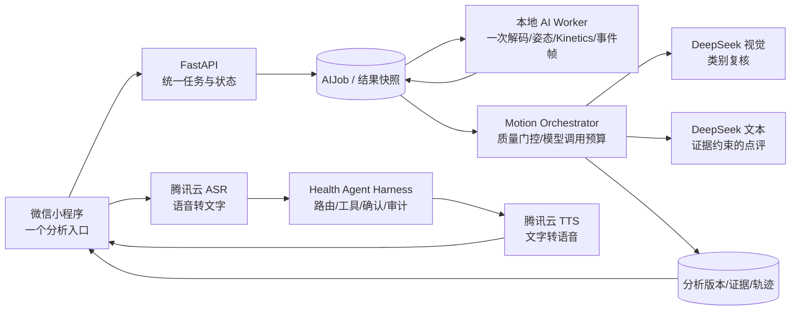

# HealthMate Harness：动作点评与语音闭环开发文档

> 版本：2026-09-29；状态：**待实施的工程规格**，不是已完成声明。实施前须固定代码提交、数据库迁移和模型配置。本文覆盖用户反馈的双入口、400 类动作缺少拆解与点评、识别可信度和 DeepSeek 协作、截图中的 422、腾讯云语音接入与费用，以及 Harness 必需的后端增强。
>
 产品边界：面向一般成年人运动和生活方式管理；不提供疾病诊断、损伤判定或康复处方。本文所列目标指标均为团队拟定的验收门槛，不是当前成绩或赛事官方标准。

## 1. 一句话目标与交付范围

用户选一个 5–20 秒视频，点一次“开始分析”，得到**一个**结果：动作类别、判断依据、开头整体点评、带时间戳的关键帧拆解，以及在有可靠评价器时的次数和动作质量评分。识别由本地姿态与 Kinetics-400 提供可复核证据，DeepSeek 视觉复核和文本解释共同参与；证据不足时明确拒识或不给分。语音输入由腾讯云一句话识别、语音输出由腾讯云基础语音合成承担，文字决策仍由既有 Health Agent Harness 与 DeepSeek 负责。所有调用可追踪、可限额、可降级、可审计。

**必须交付：**统一入口与结果页、统一动作任务及结构化结果、400 类关键帧和点评、DeepSeek 复核与有界生成、422 可诊断与恢复、腾讯云 ASR/TTS 适配、语音设置可用、调用预算与自动化验证、离线质量评估和部署手册。

**不承诺：**400 类均有可靠次数和评分；候选分值等于真实准确率；仅靠一张图就能判断完整动作周期；短期内达到医疗级精度。宣传、界面与评测报告均遵守这些边界。

## 2. 基线审计：为什么目前体验割裂

| 用户看到的问题 | 已核对的代码事实 | 改造决策 |
| --- | --- | --- |
| “开始查看”和“400 类动作识别”是两个按钮 | `miniprogram/pages/media/index.wxml` 分别绑定 `analyze`、`analyzeKinetics`；后端分别创建 `motion_pose` 与 `kinetics400` 任务 | 只保留一个“开始分析”，一个统一任务、一个结果契约 |
| 400 类没有整体点评和逐帧说明 | `kinetics.py` 只返回 top-k 类别；页面仅显示候选条；六动作路径才有 `frames`、`score` 和延迟生成的 `summary` | 统一任务输出关键帧事件、综合点评与 `scoreability`；未知动作使用通用时序解释 |
| 100% 看起来像准确率/评分 | 页面将 `top_probability` ×100 放进圆环。它是当前模型候选分值；历史同集 24 段中 Kinetics 单独 Top-1 为 16.67%，不能用单个样本的 100% 取代评测准确率 | 主结果不显示“100 分”；候选值放入详情并标明“模型候选分值，未经校准” |
| 识别与点评协作不稳定 | 现有六动作路径会在特定条件使用 DeepSeek 视觉复核、关键帧解释，并在读取结果时尝试文本总结；独立 Kinetics 路径没有同等链路 | 所有统一任务按策略进行 DeepSeek 视觉复核与解释；每阶段记录 `used/degraded/reason`，失败不冒充完整点评 |
| 截图显示 `/worker/jobs/45/complete` 返回 422 | `worker.py` 有较严格的结果字段、关键帧 JPEG/大小、识别状态等校验；Worker 客户端只保留 HTTP 状态和路径，丢失服务端可读错误原因 | 先用该任务服务端日志/数据库定位字段；增加稳定错误码和安全错误摘要；永久性 422 不重试同一无效负载 |
| 语音设置不知道该填什么 | `backend/app/harness/voice.py` 只有 OpenAI-compatible `/audio/transcriptions` 与 `/audio/speech`；`voice-test` 实际会合成“连接成功”；当前系统腾讯云适配缺失 | 新增 `tencent_cloud` provider，不要求用户填写 OpenAI Base URL；设置页展示服务端状态及额度提醒，真实连接测试必须手动触发 |
| 视频隐私文案需要修正 | 当前 `motion_review.render_stick_frames` 在**原画面**上画骨架并对估计人脸区域做模糊；注释中的“仅骨架、不上传人物画面”与实现不一致 | 真正改为纯色画布上的骨架与数值，或明确告知会上传模糊处理的关键帧；默认选前者并测试像素级脱敏 |

相关既有能力与评测见 [Harness 架构](HEALTH_AGENT_HARNESS.md)、[自动动作识别](AUTO_MOTION_RECOGNITION.md)、[创新性实施方案](HEALTHMATE_INNOVATION_COMPETITIVENESS_DEVELOPMENT_2026-09-28.md)。旧报告只作为历史基线，不当作新方案效果。

## 3. 目标架构与 Harness 角色



这里的 **Harness** 是服务端的运行内核：把模型、健康上下文、工具、权限、证据、决策、确认、预算和追踪连接起来。微信小程序是 Workspace；DeepSeek 是视觉/语言模型供应方；腾讯云是语音输入输出供应方；Worker 是本地感知工具。动作分析要注册为 `motion.analysis.read`、`motion.feedback.read` 等只读 Tool，供 Coach Agent 引用真实结果；不得让 Agent 直接改动原始测量值或用户记录。继续复用现有 `MultiAgentKernel`、`ToolRegistry` 和用户确认门，不新造平行对话系统。

### 3.1 执行状态机

`queued → decoding → local_inference → evidence_ready → visual_review → feedback_generation → completed`。

可终结为 `partial`（本地证据存在、模型不可用）、`abstained`（证据不足）、`failed`（媒体或契约错误）、`cancelled`。每阶段有开始/结束时间、版本、原因码；`completed` 不能掩盖视觉复核或点评失败。读取结果只读缓存，**不得因前端反复轮询而再次触发 DeepSeek**。旧任务接口保留一个版本周期并标 `deprecated`，新页面只用统一接口。

### 3.2 一次解码和能力协商

Worker 增加 `motion_unified_v1` 能力与处理器：视频仅下载/解码一次，复用采样帧给 MediaPipe、SlowFast 和时间轴。Kinetics 权重不在线时返回 `kinetics: unavailable` 并继续六动作；姿态不可用时可完成类别候选，但不生成姿态评分；两者都不可用则明确失败。`motion_unified_v1` 不得在 Worker 未声明能力时被领取。并发和资源占用由 Worker 侧信号量控制，避免 CPU 同时跑多个 SlowFast 任务。

## 4. 统一动作识别与点评规则

### 4.1 用户流程

1. 选择视频，默认为“自动识别”；手动选择六种动作仍作为纠错入口。
2. 仅一个“开始分析”按钮；首次点击上传并创建任务；重复点击、断网恢复和重进页面均复用同一任务。
3. 结果顶部先显示“识别到什么 / 是否可确认 / 整体点评”。随后是 3–4 个**关键时刻**，每项有时间、阶段、观察、建议、所用证据。页面文案采用“关键帧拆解”，避免暗示分析了每一帧。
4. 六类有专属评价器且关键点质量达标时显示次数、完成度、稳定性、节奏等；其他类默认显示“已识别类别，暂无可靠数值评分”，但仍有关键帧与谨慎点评。
5. 低光、遮挡、多人、视频无完整动作周期、模型意见冲突时显示“暂不能确定”，可手动选动作重分析或重拍。手动选择不会把未测量的分数变成实测值。

### 4.2 识别融合，避免伪精度

| 层 | 输入 | 输出 | 权限 |
| --- | --- | --- | --- |
| 本地姿态 | 时序关键点、可见率、角度 | 六类匹配、动作阶段、关节测量、输入质量 | 可给有规则的六类打分 |
| Kinetics-400 | 采样视频片段 | 400 类 top-k、原始候选分值 | 提供候选，不直接生成质量评分 |
| DeepSeek 视觉 | 已脱敏的 3–4 张关键帧、时间顺序、数值摘要与候选 | 候选复核、冲突说明、是否需要拒识 | 只能引用证据；不能自报“准确率”或改写测量值 |
| 决策门 | 前三者结果、质量阈值、模型版本 | `recognized / uncertain / abstained`，选定类和理由 | 由代码执行；冲突时优先拒识或要求确认 |
| DeepSeek 文本 | 锁定的事实、事件和用户已确认目标 | 整体点评、逐帧观察与一条可执行建议 | 不写数据库事实、不编造角度/次数/医学结论 |

**默认每个具备有效视频证据的统一任务都尝试一次视觉协作**，这样 400 类不再是本地单独工作；空视频/关键点严重不足时不发送无效请求。DeepSeek 不在线时如实返回 `degraded=true`、`review_status=unavailable`，保留本地可验证事实。相同 `media_sha256 + pipeline_version + model_version + consent_version` 的视觉复核和点评可缓存，节省调用并防止轮询重复计费。缓存须按用户隔离，用户撤回同意或删除媒体后清理。

当前 DeepSeek 官方文档已明确 `deepseek-flash` 支持 JPEG/PNG/GIF/WebP 图像输入，图像按 token 计费；它接收的是**抽取出的关键帧**，不能把这条接口写成直接理解整段视频。[官方视觉文档](https://api-docs.deepseek.com/guides/vision/)。`DEEPSEEK_VISION_MODEL` 保留可配置，并在发布时锁定实际型号和 API 回包契约。修订当前复核提示词中“只要有人就给中等以上置信度”的诱导语，要求缺证据时必须拒识。

### 4.3 分数与可信度展示

- `candidate_score`：模型在自身 400 类空间的候选分值，**不是准确率**；放在折叠详情，附模型名与版本。
- `calibrated_confidence`：只有独立校准集、校准方法和可靠性图通过验收后才显示“判断把握度”，否则为 `null`。
- `quality_score`：只对已定义动作专属评价器、完整动作周期、足够关键点可见率的样本输出；其范围 0–100 表示本次动作质量维度，不是识别准确率或医学风险。
- `recognition_accuracy`：只能出现在评测报告，附数据集、样本数、分母、拒识处理和置信区间；不能作为单个用户视频的数值。
- DeepSeek 的自报 `confidence` 只能作为复核参考，不与本地 softmax 简单加权得出对外百分比。

### 4.4 统一结果契约（示例，字段命名作为实现目标）

```json
{
  "analysis_id": 318,
  "status": "completed",
  "pipeline_version": "motion-unified-v1",
  "recognition": {
    "state": "recognized",
    "label_id": "front_raises",
    "label_zh": "前平举",
    "candidate_score": 0.82,
    "calibrated_confidence": null,
    "evidence": ["frame:0", "frame:2", "pose:shoulder_range"],
    "sources": ["kinetics400", "mediapipe", "deepseek_vision"],
    "review_status": "used",
    "reason": "手臂在身体前方向上抬起；画面未覆盖足够周期确认全部细节"
  },
  "score": {"available": false, "reason_code": "NO_VALIDATED_SCORER"},
  "summary": {
    "text": "画面更像前平举。可以先放慢抬起和放下的速度，并保持身体稳定；这段视频还不足以给出可靠的动作评分。",
    "source": "deepseek_grounded",
    "degraded": false
  },
  "keyframes": [
    {"id": "frame:0", "t_ms": 1200, "phase": "准备", "finding": "双臂接近身体两侧", "advice": "保持站姿稳定", "image_url": "<短期签名地址>", "evidence_type": "visual_observation"}
  ],
  "limitations": ["结果仅供一般健身参考"],
  "trace_id": "<服务端生成的 ID>"
}
```

`keyframes` 最多 4 张预览；没有可靠分相时用“开始/中间/结束”时间位置，不声称对应标准动作阶段。没有可验证画面就只返回时间点和拒识原因。生成文本必须引用现有 `frame:id` 或测量字段，服务端用 JSON Schema/Pydantic 验证“引用存在、时间递增、无空建议、长度上限、禁用医疗表述”，失败转结构化规则文案并标记降级。不要让模型生成新的图像 URL。预览图继续遵守大小与 7 天保留策略。

### 4.5 核心决策代码草案

以下是需要落地在 `backend/app/services/motion/` 的**示意代码**，不是现有已上线实现；实际字段以统一 Pydantic 契约为准：

```python
from dataclasses import dataclass
from typing import Literal

SUPPORTED_SCORERS = {"squat", "pushup", "lunge", "leg_abduction", "arm_abduction", "arm_vw"}

@dataclass(frozen=True)
class MotionDecision:
    state: Literal["recognized", "uncertain", "abstained"]
    label_id: str | None
    reason_code: str
    scoreable: bool

def decide_motion(local, kinetics, review, quality) -> MotionDecision:
    if not quality.has_person or quality.usable_frames < 3:
        return MotionDecision("abstained", None, "INSUFFICIENT_VIDEO_EVIDENCE", False)
    candidates = {c.label_id for c in kinetics.candidates[:5]}
    if local.accepted and local.label_id:
        candidates.add(local.label_id)
    if review is None or review.label_id == "unknown":
        return MotionDecision("uncertain", None, "REVIEW_UNAVAILABLE_OR_UNCERTAIN", False)
    if review.label_id not in candidates or not review.evidence_ids:
        return MotionDecision("uncertain", None, "UNSUPPORTED_REVIEW", False)
    if local.accepted and local.label_id != review.label_id and quality.pose_reliable:
        return MotionDecision("uncertain", None, "MODEL_DISAGREEMENT", False)
    label = review.label_id
    return MotionDecision("recognized", label, "EVIDENCE_AGREEMENT", label in SUPPORTED_SCORERS and quality.full_cycle and quality.pose_reliable)
```

此决策倾向“保留疑问”，不能因 DeepSeek 同意某个高 softmax 候选就推断高准确率。上线阈值必须由独立验证集决定；这里的 `usable_frames < 3` 仅为初版安全门草案。

### 4.6 DeepSeek 请求与输出约束（代码草案）

视觉请求由服务端网关发起；关键帧必须是预处理后的 JPEG，不允许前端传任意外部 URL。模型返回的类别只在候选集或 `unknown` 中选择，解释逐条引用有效帧 ID；请求和响应都受长度、次数、超时和 schema 限制。

```python
from pydantic import BaseModel, Field
from typing import Literal
import base64

class FrameFinding(BaseModel):
    frame_id: str
    observation: str = Field(min_length=2, max_length=100)
    advice: str = Field(min_length=2, max_length=100)

class VisionReview(BaseModel):
    label_id: str                 # 候选 label_id 或 unknown
    evidence_ids: list[str] = Field(max_length=4)
    findings: list[FrameFinding] = Field(max_length=4)
    reason: str = Field(max_length=160)

def build_vision_message(frames: list[tuple[str, bytes]], facts: dict) -> list[dict]:
    content = [{"type": "text", "text": make_bounded_evidence_prompt(facts)}]
    for frame_id, jpeg in frames[:4]:
        content.append({"type": "text", "text": f"frame_id={frame_id}"})
        content.append({"type": "image_url", "image_url": {
            "url": "data:image/jpeg;base64," + base64.b64encode(jpeg).decode("ascii"),
            "detail": "low",
        }})
    return [{"role": "user", "content": content}]

def validate_review(review: VisionReview, candidate_ids: set[str], frame_ids: set[str]):
    if review.label_id not in candidate_ids | {"unknown"}:
        raise ValueError("unsupported_label")
    if not set(review.evidence_ids).issubset(frame_ids):
        raise ValueError("invented_evidence")
    if any(item.frame_id not in frame_ids for item in review.findings):
        raise ValueError("invented_frame")
```

`make_bounded_evidence_prompt` 应只序列化动作候选、关节测量、时间戳和输出 JSON schema；调用参数沿用现有 `motion_review.py` 的 `/chat/completions` 适配，模型用配置中的 `deepseek-flash`，并把解析后的 `VisionReview` 交给确定性决策门。上述代码强调接口约束；完整实现还必须校验 JPEG 魔数/像素、请求体积、用户同意和禁用自由外链。文本点评另一次调用只接收**已决定的结构化事实**，不能重新判类或写评分。

## 5. 新接口与兼容策略

所有路径均在 `/api/v1` 下；沿用现有登录鉴权和用户隔离。写操作带 `Idempotency-Key`，同一键和同一素材返回同一任务；不同参数返回 409。错误统一 `{code,message,request_id,retryable,details?}`，`details` 仅包含安全字段与字段路径。

| 接口 | 请求 | 响应 / 说明 |
| --- | --- | --- |
| `POST /media/motion-analyses` | `{media_id, requested_exercise:"auto"|六类, consent_deepseek_frames, pipeline_version}` | `202 {analysis_id, status, poll_after_ms}`；一次创建统一任务 |
| `GET /media/motion-analyses/{id}` | 无 | 状态、阶段进度、统一结果；纯读取，不触发模型调用 |
| `POST /media/motion-analyses/{id}/retry` | `{reason:"after_fix"}` | 仅 terminal failed 且新 `pipeline_version` 或显式 `analysis_revision`，生成新任务并关联父 ID；避免旧去重键永远返回失败任务 |
| `POST /media/motion-analyses/{id}/confirm-label` | `{label_id, correction_reason}` | 记录用户确认/纠错；不会伪造评分；如属于六类可发起可评价重分析 |
| `GET /media/motion-analyses/{id}/trace` | 无 | 用户可读的来源、降级和依据摘要；内部详细轨迹另走管理权限 |
| `POST /media/motion-analyses/{id}/feedback` | `{useful:boolean, label_correction?, frame_id?, comment?}` | 收集“类别错/关键帧不准/建议无用”等反馈，按用户隔离与去重；不自动当训练标签 |
| `GET /media/motion-analyses/{id}/evidence` | 无 | 返回关键帧、测量值、模型来源与版本的可读证据链，短期图像过期后仅留结构化证据 |
| `GET /harness/voice/status` | 无 | `{provider,configured,asr_available,tts_available,last_verified_at,live_check_required}`；不调用云服务 |
| `POST /harness/voice/transcribe` | 沿用 `{agent_id,audio_base64,format}`，新增 `request_id` | `{text,agent_id,provider,trace_id}`；Tencent 路径仅允许受支持格式与 ≤60 秒/≤3 MB（以官方限制和编码后大小双重检查） |
| `POST /harness/voice/synthesize` | `{agent_id,text,request_id}` | `{segments:[{index,audio_base64,content_type}],provider,trace_id}`；每段 ≤安全字数，小程序顺序播放；旧单段 `audio_base64` 暂兼容一个版本 |
| `POST /harness/voice/verify-once` | `{provider:"tencent_cloud",check:"asr"|"tts",acknowledge_quota:true}` | 管理员/配置者手动触发；相同配置指纹、方向已成功验证时返回缓存记录，不重复调用 |
| `GET/PUT /users/me/ai-config` | 新增 `voice_provider:"tencent_cloud"|"openai_compatible"|"off"` 和语音偏好 | 腾讯云模式只显示服务端状态与音色选择，不接收 `SecretId/SecretKey` 到小程序 |

旧 `/media/motion-jobs` 与 `/media/kinetics-jobs` 先保持后端兼容，前端在新接口可用后不再调用。旧结果保留原显示和来源标识；不能用新 schema 假装旧任务已经经过 DeepSeek 复核。`/users/me/ai-config/voice-test` 现会真实生成语音，须从设置页移除自动调用并改为明确的手动验证入口。

## 6. 422 回执故障的修复路径

**先诊断，再改 schema：**查 `job_id=45` 的 `job_type`、Worker 版本、阶段、服务端 `request_id` 与回执校验日志；不可仅凭截图断言哪个字段错。当前 `_validate_motion_result` 会拒绝 `pose.available` 缺失、无效次数/可见率、超过 4 张或 80 KB/JPEG 不合法的预览、`recognition` 状态不一致、拒识却打分等；任务业务规则还会拒绝自动任务没有可信识别结果。完整清单以代码和本次日志为准。

改造：

1. Backend 使用独立的 `MotionWorkerResultV1` Pydantic 契约，Worker 发送前在本地用**同版 schema**预校验；schema 版本放在回执。校验失败返回 `422 MOTION_RESULT_SCHEMA_INVALID` + 首个字段路径 + request ID，日志保存脱敏摘要，不保存整段视频/图像 base64。
2. Worker 的 `CloudAPIError` 保存安全响应体中的 `code`、`field_path`、`request_id`；对 422 和 413 判为不可重试并上报失败，避免租约到期后重复领取同一必失败任务。409 租约冲突单独处理。
3. 用原失败回执的**脱敏结构**做回归 fixture；补缺失/多余字段、帧数量、无效 JPEG、拒识仍打分、版本不匹配等契约测试。新服务端先兼容旧 Worker 一个版本，随后分阶段强制新 schema。
4. 修复后使用同一素材的新 pipeline revision 重建任务；旧任务保留失败原因和父子关联，便于审计。

建议错误响应：

```json
{"code":"MOTION_RESULT_SCHEMA_INVALID","message":"动作分析结果格式不符合约定","request_id":"req-...","retryable":false,"details":{"field_path":"keyframes[2].image_mime"}}
```

## 7. 腾讯云一句话识别 + 语音合成的工程接入

### 7.1 正确服务边界与配置

腾讯云 ASR `SentenceRecognition` 用于 60 秒内短音频；当前小程序录音最长 30 秒，可继续使用 MP3。腾讯云 TTS `TextToVoice` 用于短文本；中文单次最多 150 汉字，因此当前 `speak(reply.slice(0,800))` 必须改为**服务端分句、逐段合成，客户端顺序播放**。MP3 分片不能简单字节拼接。接口限制见[一句话识别](https://cloud.tencent.com/document/api/1093/35646)及[基础语音合成](https://cloud.tencent.com/document/api/1073/37995)。

生产环境只在后端密钥管理中设置腾讯云 `SecretId/SecretKey`，给服务账号最小 ASR/TTS 权限。小程序和 Worker 不持有密钥，不把密钥写进 `user_ai_configs` 的 OpenAI-compatible 字段。若未来确实允许用户自带腾讯云密钥，应设计**独立**加密字段、密钥轮换和授权说明；当前版本优先系统统一配置。

```env
VOICE_PROVIDER=tencent_cloud
TENCENT_SECRET_ID=
TENCENT_SECRET_KEY=
TENCENT_REGION=ap-shanghai
TENCENT_ASR_ENGINE=16k_zh
TENCENT_TTS_VOICE_TYPE=<控制台核对后的基础/精品音色ID>
VOICE_MAX_AUDIO_BYTES=2500000
VOICE_MONTHLY_ASR_BUDGET=100
VOICE_MONTHLY_TTS_CHARS_BUDGET=30000
VOICE_LIVE_VERIFY_ENABLED=false
```

`VOICE_MAX_AUDIO_BYTES` 取保守值，因官方 ASR 文档还要求 Base64 后音频大小不超过 3 MB；最终限制以选用的传输模式和实测文档为准。语音 API 对空音频、格式伪装、超时长、超字数、并发超限、超预算先本地拒绝，避免浪费额度。服务端可做音频解码与时长探测，但不留存原始语音；用户同意和隐私说明覆盖向腾讯云传输语音/文本。

### 7.2 供应方接口与核心代码草案

增加 `VoiceProvider` 协议和 `TencentCloudVoiceProvider`，保留现有 `OpenAICompatibleVoiceProvider`。选用腾讯云官方 Python SDK 3.0（依赖版本锁定）；同步 SDK 放入受限线程池，不能阻塞 FastAPI 事件循环。下面是主要调用形状，异常映射、超时、配置校验、指标与预算检查由外围网关补齐：

```python
import base64
import json
from uuid import uuid4
from starlette.concurrency import run_in_threadpool
from tencentcloud.common import credential
from tencentcloud.asr.v20190614 import asr_client, models as asr_models
from tencentcloud.tts.v20190823 import tts_client, models as tts_models

class TencentCloudVoiceProvider:
    def __init__(self, secret_id: str, secret_key: str, region: str, engine: str, voice_type: int):
        cred = credential.Credential(secret_id, secret_key)
        self.asr = asr_client.AsrClient(cred, region)
        self.tts = tts_client.TtsClient(cred, region)
        self.engine = engine
        self.voice_type = voice_type

    async def transcribe(self, audio: bytes, fmt: str) -> tuple[str, str]:
        if fmt not in {"mp3", "m4a", "aac", "wav"} or not audio:
            raise ValueError("unsupported_audio")
        def call():
            req = asr_models.SentenceRecognitionRequest()
            req.from_json_string(json.dumps({
                "EngSerViceType": self.engine,
                "SourceType": 1,
                "VoiceFormat": fmt,
                "Data": base64.b64encode(audio).decode("ascii"),
                "DataLen": len(audio),
                "SubServiceType": 2,
            }))
            return self.asr.SentenceRecognition(req)
        response = await run_in_threadpool(call)
        return response.Result.strip(), response.RequestId

    async def synthesize_segment(self, text: str) -> tuple[bytes, str]:
        def call():
            req = tts_models.TextToVoiceRequest()
            req.from_json_string(json.dumps({
                "Text": text,
                "SessionId": uuid4().hex,
                "VoiceType": self.voice_type,
                "Codec": "mp3",
            }))
            return self.tts.TextToVoice(req)
        response = await run_in_threadpool(call)
        return base64.b64decode(response.Audio, validate=True), response.RequestId
```

`SubServiceType`、引擎名、音色 ID 与 SDK 模型字段以部署时的官方接口文档核对；SDK 版本必须锁在依赖文件，并用 MockTransport/SDK stub 验证请求体。返回的腾讯云 `RequestId` 只写入脱敏调用账本。TTS 文本按中文句号/逗号优先拆分，每段保守不超过 120 个 Unicode 字符，超过则进一步按字符边界拆；不得悄悄截断原回复。若第 2 段失败，前端只播放成功段并显示完整文字，避免重复合成前 1 段。

### 7.3 免费额度、计费和“连通后停测”

截至本文日期，腾讯云官方说明：一句话识别每月有 **5000 次成功识别免费额度**；基础/精品音色的通用 TTS 免费资源包为**一次领取 800 万字符，领取后 3 个月有效**。免费额度、账号是否开通后付费、音色类型与剩余量必须以控制台为准。当前官方后付费示例中，低量级一句话识别为约 **3.2 元/千次**；精品音色 TTS 为 **0.3 元/万字符**。以一次识别 + 150 字播报估算，超出免费额度后约 `3.2/1000 + 150×0.3/10000 = 0.0077 元`，另加 DeepSeek 和云资源费用。价格会调整，预算模块不硬编码它为永久报价。[ASR 费用](https://cloud.tencent.com/document/product/1093/35686)、[TTS 费用](https://cloud.tencent.com/document/product/1073/34112)。

**用户明确要求的验证策略：**静态配置检查、SDK stub、端到端模拟响应和真机 UI 检查先完成；外部接口只在前述全部通过后，针对 ASR 和 TTS **各做一次最小真实连通验证**。成功后将 `verified_at + config_fingerprint + provider_request_id` 写入 `provider_connection_checks`，设置页不再自动测试；同一配置指纹不允许重复真调用。未来改密钥、地区或音色时才允许人工明确触发新验证。DeepSeek 也只做必要的最小线上确认；成功后回归用录制并脱敏的响应 fixture。注意离线测试不能证明外部服务持续可用，UI 应显示“上次验证时间”，不要写“永久已连接”。

## 8. 必要的后端增强

### 8.1 数据模型与迁移

以现有迁移 `0023_user_voice_config.py` 为基线，新增**一个可回滚的后续迁移**，不修改历史迁移：

| 表 / 字段 | 作用与约束 |
| --- | --- |
| `motion_analysis_runs` | `id,user_id,media_asset_id,ai_job_id,parent_run_id,requested_type,pipeline_version,status,consent_version,model_versions_json,created_at,finished_at`；用户与媒体索引、同请求唯一键 |
| `motion_analysis_feedback` | `run_id` 唯一；结构化识别、分数可用性、关键帧引用、summary、来源/降级、schema_version；大图片放短期对象存储，不放长文本 JSON |
| `provider_invocations` | `user_id,run_id,provider,operation,request_fingerprint,status,latency_ms,token_or_char_count,provider_request_id,cost_estimate,created_at`；不存原始音频、图片、完整 prompt 或密钥 |
| `provider_connection_checks` | 配置指纹、方向、上次成功时间、调用 request ID；成功唯一约束用于“连通后停测” |
| `voice_usage_daily` | 按用户/日/供应方统计 ASR 次数、TTS 字符、失败数；额度是本地预算，不冒充腾讯云控制台真实余量 |

动作事件仍复用 `motion_events`，六类分数仍复用 `motion_scores`，避免两套画像。用户删除账号/素材时级联或显式清理反馈、预览和调用明细；调用日志只保留满足审计的最短期限和脱敏字段。迁移验证包括 SQLite 开发环境与 MySQL 生产目标的 fresh / incremental / repeat 三条路径；真实库先备份、灰度读兼容，再切写入。

### 8.2 调用网关与安全

- 统一 `ProviderGateway`：幂等键、每任务次数上限、请求超时、限并发、退避策略、熔断、预算检查。对可计费的生成调用，超时后先查本地状态；**不盲目自动重试**，因为上游可能已经成功扣量。
- 对模型输出做结构化解析、字段白名单、证据引用核对、敏感内容复核。仅确定性代码可写次数、角度、评分、时间和用户确认状态。模型提示词与返回结果视为不可信数据，不能触发任意工具名或写操作。
- `ToolRegistry` 新增只读动作结果工具，按 `user_id` 范围查找；任何计划写入沿用 `proposal_only → user_confirmed → apply_plan`。动作结果中的外部文本不能成为系统指令。
- DeepSeek 关键帧发送前用**纯色画布骨架图**或经用户同意的真实帧；纯色方案要做像素检查确认不存在原人物/背景。用户可关闭云端视觉协作，此时页面明确标“仅本地分析”。
- 语音和视频使用单独的短期存储策略；TLS、密钥管理、访问审计、媒体授权与导出/删除遵守现有隐私服务。TTS 回复文本长度、ASR 上传大小和小程序请求体限制在网关统一校验。

### 8.3 可观测性与成本

每个任务/语音回合贯穿 `trace_id`，服务端追踪含 `analysis_id,job_id,worker_id,pipeline_version,model_version,stage,duration,error_code,provider_request_id`。监控队列等待与 P50/P95、Worker 离线、422 比率、拒识率、DeepSeek 降级率、ASR/TTS 成功率、每任务成本和月预算。日志不记录原视频、原语音、完整密钥、图像 base64 或私有推理。用户页只显示能理解的状态与修复建议，管理页可根据 request ID 排障。

### 8.4 能形成竞争力的延展能力

- **证据到行动的连续链：**通过现有 Agent `decision_id` 把某次动作分析、用户确认的训练目标、下一次练习和一周后的复盘连接起来。复盘只比较确实可比的动作、机位和指标，并显示样本数；不能把练习变化表述为医疗或因果效果。
- **用户纠错驱动质量治理：**错类/错帧反馈进入待复核池，连同匿名化样本 ID、模型版本与原因码形成错误分布。只有取得额外同意且具备合法数据授权时才可保留媒体供人工标注；反馈本身不能直接改写测试真值或触发自动训练。
- **可复演的 Agent 轨迹：**保留最小证据快照和工具调用摘要，支持在同一脱敏 fixture 上重放新旧决策策略；结果报告同时显示质量、延迟、花费和失败路径。这样 Harness 的竞争点是“可验证地改进”，而不只是接了多个模型。
- **个体化但有界：**用户已确认的目标和近期训练负荷可影响点评优先级；年龄、病史等敏感数据只能按明确授权读取，模型不能自行提高训练强度或写入计划。任何计划调整保持 proposal-only 与用户确认。

## 9. 质量评估：工程成功与智能能力分开验收

| 维度 | 最小交付证据 | 禁止替代的口径 |
| --- | --- | --- |
| 契约可靠性 | 统一任务创建/轮询/恢复/取消/重试、422 fixture、跨用户隔离、迁移和失败注入均通过 | 只看一次成功演示 |
| 六类识别 | 独立受试者划分；全样本准确率、覆盖率、Macro-F1、逐类召回、拒识矩阵、95% 区间 | 只报已接受样本准确率或演示样本 |
| 400 类识别 | 先定义与产品相关的目标子集及未知类；Top-1/Top-5、混淆、类外误报、分机位结果；400 类整体声明必须有相应完整数据 | 用 softmax 100% 称“准确率 100%” |
| DeepSeek 增益 | 同一冻结集比较“本地”“本地+Kinetics”“本地+DeepSeek”“三者融合”；报告净增益、额外误判、拒识变化、延迟、成本 | 仅看点评更像人说话 |
| 关键帧/点评 | 人工标注关键事件容差、引用正确率、幻觉率、可执行建议双人盲评；模型输出不改变数值事实 | 将文字流畅度当作动作正确率 |
| 数值评分 | 六类评分器分别验证角度/次数误差、评分一致性与机位边界；无评价器动作必须 `score.available=false` | 400 类均显示分数 |
| 语音 | SDK stub 和错误注入全覆盖；各接口一次真实连通验证后停止线上测试；真机可录制/播报/拒绝权限/弱网降级 | 反复消耗免费额度做回归 |
| 安全与隐私 | 云端关键帧脱敏检验、越权 404、同意撤回、删除/导出、健康禁忌文本抽检 | 只有免责声明 |

现有 REHAB24-6 120 段基线全样本准确率 41.67%，它已经用于历史开发，**不能再当新模型最终独立测试集**。新版本先冻结受试者分组与未见视频；至少保留一组未知动作/非锻炼片段。效果没有真实评估前，发布语只说“融合识别与可追踪点评”，不写“高准确率”。必要的上游最小连通调用与真实质量评估是不同事情：**前者一次即可；后者若需额外付费样本评估，先从已有合法缓存和离线标注开始，另列预算与样本计划**。

## 10. 分阶段实施、文件落点和完成标准

| 阶段 | 代码落点 | 完成定义 |
| --- | --- | --- |
| P0-A 契约与 422 | `backend/app/schemas/worker.py`、`api/v1/worker.py`、`ai-worker/healthmate_worker/client.py`、共享契约测试 | 能从 request ID 定位字段；无效回执不循环重试；截图同类故障可复现并修复 |
| P0-B 统一动作链 | `ai-worker/healthmate_worker/processors/`、`worker.py`、`backend/app/services/motion/`、`api/v1/media.py` | 一次点击仅一任务；视频只解码一次；六类和 400 候选进入一个结果；断网恢复不重复创建 |
| P0-C 点评与前端 | `motion_review.py`、`result_summary.py`、`miniprogram/pages/media/index.js/wxml/wxss` | 开头点评、3–4 关键帧、来源/限制、可评价/不可评价状态正确；无 100% 假准确率；同素材重复读取不重复调用模型 |
| P0-D 腾讯云语音 | `backend/app/harness/voice.py` 新 provider、`api/v1/harness.py`、`ai_config.py`、设置页与首页录音/播放 | ASR → Harness → TTS 路径可用；腾讯云密钥只在后端；长回复分段；配置页状态准确 |
| P1 Harness 融合 | `backend/app/harness/tools.py`、`collaboration.py`、调用账本与迁移 | Coach 能引用动作证据回答；所有建议含来源，写入必须确认；跨账号不可读 |
| P1 质量与答辩 | `benchmark/`、`benchmark-results/`、`docs/` | 独立集、消融、双人评审、成本与失败案例可复算；演示一个真实视频和一次语音闭环 |

**发布门禁：**后端/Worker/小程序现有测试通过；新契约、迁移、权限、隐私、成本限额通过；真机弱网和未授权麦克风处理通过；外部语音各一次连通后停止真实调用；DeepSeek 阶段状态和降级有明确 UI；独立集结果与对外文字一致。若某阶段未达标，功能开关保持关闭，旧结果可读，新入口不向所有用户开启。

## 11. 立即可执行的开发顺序

1. 冻结当前提交、环境配置（不记录密钥）、Worker/模型版本；取截图对应 `job_id=45` 的服务端诊断证据，先修 422。
2. 定义统一请求/响应 JSON Schema、阶段错误码、数据库迁移和旧接口兼容期；将 UI 设计确认成一个按钮、一个结果页。
3. 先完成 Worker 单次解码与 Backend 统一任务，再接 Kinetics、关键帧、DeepSeek 视觉复核和文本点评；每段完成离线 fixture 验证。
4. 接腾讯云服务端 provider、设置页状态、分段播报与调用预算；完成全部 stub 检查后各做一次真实 ASR/TTS 连通验证，成功立即停测。
5. 做独立集和真实用户可理解性评估，按证据决定是否开启默认融合；最后更新演示脚本、隐私文案、部署指南和对外能力表。

## 12. 官方接口和内部事实来源

- [DeepSeek Vision API：模型、图片格式、请求形状与 token 规则](https://api-docs.deepseek.com/guides/vision/)
- [腾讯云一句话识别 API：限制、`SentenceRecognition` 与字段](https://cloud.tencent.com/document/api/1093/35646)
- [腾讯云基础语音合成 API：`TextToVoice` 与文本长度](https://cloud.tencent.com/document/api/1073/37995)
- [腾讯云 ASR 计费](https://cloud.tencent.com/document/product/1093/35686)；[腾讯云 TTS 计费](https://cloud.tencent.com/document/product/1073/34112)
- 项目内部：[Harness 当前实现](HEALTH_AGENT_HARNESS.md)、[动作现状](AUTO_MOTION_RECOGNITION.md)、[历史评测和边界](HEALTHMATE_INNOVATION_COMPETITIVENESS_DEVELOPMENT_2026-09-28.md)
