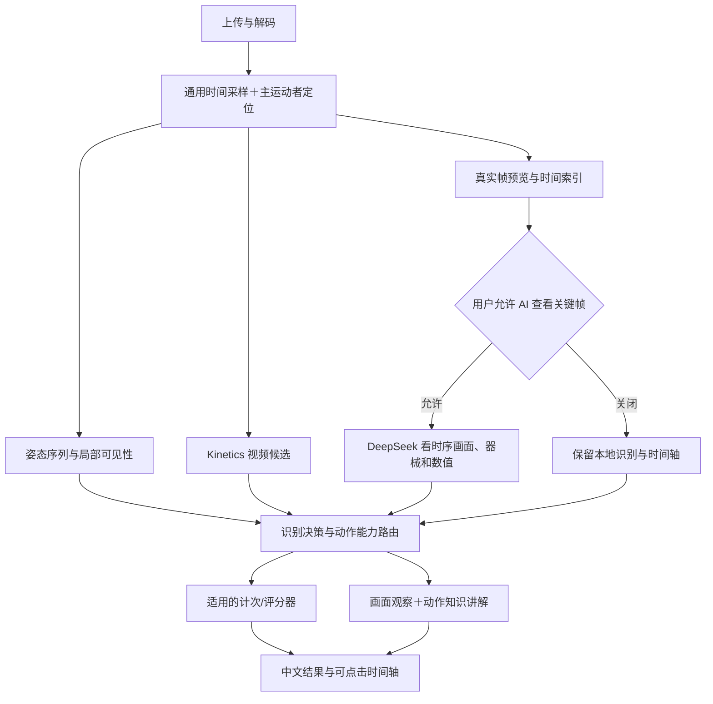

# HealthMate 动作分析 V2：识别能力、教练点评与视频时间轴重建开发文档

> 编制日期：2026-09-30。代码审计基线：`e858ff5`。状态：**开发规格，尚未实施**。
>
> 本文根据用户提供的三张实际运行截图和当前代码编写。对于动作识别、视觉复核、关键帧、点评和页面展示，以本文替换 [2026-09-29 方案](HEALTHMATE_HARNESS_MOTION_VOICE_ENGINEERING_SPEC_2026-09-29.md)中相冲突的设计。上一版“必须云端复核才能认出动作”“类别必须在本地候选内”“默认只用骨架图进行视觉复核”的限制需要撤销。语音接入方案继续保留；外部服务连通后不再重复真实测试、保留免费额度的要求继续有效。

## 1. 交付目标：用户看完能知道自己练了什么、哪里值得调整、下一遍怎么做

V2 的完整体验是：上传视频 → 一次分析 → 自然语言整体点评 → 带真实视频画面的时间轴 → 点某个时刻看详细讲解 → 回看原视频对应位置 → 选择一条下次练习建议。已具备计次或量化评价能力的动作显示相应指标；没有专属评分器的动作仍然可以识别、拆解、讲解和提供建议。

本次开发的优先目标是修复实际可用性。允许系统有依据地表达“看起来是哑铃弯举”，允许它描述清楚可见的上肢动作；不把“脚部未入镜”“未完成一个周期”“云端暂不可用”统统解释为“无法识别”。同时，图像中看不到的关节、重量、疼痛、受力、肌肉激活和医学结论不能编造。

验收必须使用用户截图对应的三种情境：**深蹲且开启 AI 分析、同样深蹲且关闭 AI 分析、六类之外的哑铃训练**。截图不是视频真值：第三个动作需要完整原视频判断，不能只凭静态截图写死为“弯举”或“前平举”。

## 2. 已确认问题与代码根因

下表区分“已从代码确认的缺陷”和“仍需原视频验证的模型误判”，实施者应先修确定性缺陷。

| 编号 | 实际问题 | 当前根因和代码位置 | 必须改变的行为 |
| --- | --- | --- | --- |
| R01 | 点评包含 `squat`、`frame:0`、`max_rule_risk` 等，像调试日志 | `text_summary.build_summary_prompt` 要求引用内部 ID；`orchestrator.py` 给摘要模型的帧信息主要是 `event`，缺少已有中文观察和建议；`clean_summary_text` 只检查长度与医学关键词 | 模型获得有意义的观察，正文只出现自然中文；ID 存结构化引用字段 |
| R02 | 逐帧画面没有人物、器械和背景 | `motion_unified._build_keyframes` 只调用 `render_skeleton_canvas`，同一张骨架图用于复核和界面 | 用户预览恢复实际视频帧；复核输入独立配置，支持有明确同意的真实关键帧 |
| R03 | 关闭云端后原本能认出的深蹲也拒识 | `decision.decide_motion` 只要 `review is None` 就返回 `uncertain`，丢弃已接受的本地识别 | 本地结果独立成立；云端补充或纠错，关闭云端不清空识别与计次 |
| R04 | 六类之外的动作显示“没检测到足够人物帧” | Worker 六类拒识分支直接 `event_frames=[]`；后端把关键事件条数当成有效视频帧数 | 通用抽帧与人物检测独立于六类规则；六类拒识后仍能提供图像、上肢运动数据和视觉识别 |
| R05 | 400 类能力名义上接入，实际没有发挥作用 | Worker 返回 `receipt.kinetics`；`handle_unified_worker_result` 只从 `recognition.candidates` 构建候选，未合并 `kinetics.candidates` | 按命名空间归一化并真正合入 Kinetics 候选；记录是否实际参与 |
| R06 | DeepSeek 不能纠正本地未列出的动作 | `validate_review` 拒绝一切候选集合以外的标签；六类候选已决定视觉模型的上限 | 候选仅作参考，视觉模型可提出新的常见动作类别，并以画面证据验证 |
| R07 | 复核条件过严 | 视觉提示词把人物不完整、动作周期不完整、关键点不可见都作为必须返回 unknown 的条件 | 按任务分别判断：识别弯举可依赖上半身；计完整次数才要求周期；下肢评分才要求对应关节 |
| R08 | 时间轴顺序混乱 | Worker 按风险/最低点优先级选帧后未按时间重排；后端用数组首尾强行写“开始/结束” | 先按信息量选择，再按真实时间升序；动作阶段来自证据，数组位置只代表时间位置 |
| R09 | 无云端时逐帧出现英文事件码与空泛建议 | `_build_result` 忽略 Worker 的 `finding/advice/phase`，缺复核就显示 `event` 和固定“保持站姿稳定” | 优先使用有效中文观察；卧姿、上肢、静态动作不能共用“站稳”模板 |
| R10 | 本地关键帧也消失 | Worker 将预览生成与 `consent_deepseek_frames` 绑定 | 关闭第三方模型传输，不影响用户查看自己的视频关键帧 |
| R11 | 未识别却显示“已识别类别”，还有 `(NOT_RECOGNIZED)` | `motionUnifiedView.js` 无评分说明固定；原始 reason code 直接进入 WXML | 按真实状态显示中文；正常用户界面不出现诊断码、provider ID、未校准说明堆叠 |
| R12 | 响应与重新分析容易复用旧状态 | `toggleConsent` 不清 `analysisId`；轮询超时后仍可能构建结果；`correctLabel` 只允许返回六类选择器 | 修改模式后创建正确的新任务；超时保留进行中状态；纠错支持更多类别和自由描述 |
| R13 | 确認/反馈接口有边界问题 | 未识别也能提交 `user_confirmed`；前端 `label_correction=true` 与后端字符串类型不符；帧反馈总取第一帧 | 确認必须有实际标签；错误反馈结构统一；反馈关联当前选中帧，失败显示可重试提示 |
| R14 | 同步回执中调用云模型，影响租约与任务一致性 | Worker `/complete` 内调用同步视觉和文本模型；编排内部提交结果后，外层才写 AIJob done；部分异常状态可能随事务回滚 | 回执只做校验与入库；持久化后处理任务负责模型调用；阶段状态有独立提交点 |
| R15 | 清理只覆盖旧动作任务 | `purge_expired_motion_previews` 只筛 `job_type=motion_pose`；统一结果又保存 data URL | 新旧预览统一纳入短期存储、到期删除和账号删除；不长期在数据库保存图像 base64 |

源码入口：

- [Worker 统一处理器](../ai-worker/healthmate_worker/processors/motion_unified.py)
- [后端决策门](../backend/app/services/motion/decision.py)、[编排](../backend/app/services/motion/orchestrator.py)
- [视觉复核](../backend/app/services/motion/vision_review.py)、[整体点评](../backend/app/services/motion/text_summary.py)
- [展示模型](../miniprogram/utils/motionUnifiedView.js)、[页面](../miniprogram/pages/media/index.wxml)

## 3. 产品决策与能力边界

### 3.1 把能力按任务拆开

每次分析分别给出以下能力的状态，不能用一个 `pose.available` 代表全部成功或全部失败：

| 能力 | 可以依据什么完成 | 缺少什么才应该关闭 |
| --- | --- | --- |
| 动作名称 | 姿态时序、器械与运动方向、视频模型或视觉模型 | 这些证据都不能区分合理候选 |
| 关键帧时间轴 | 视频成功解码、有代表性帧 | 视频损坏或帧无法访问 |
| 画面描述 | 实际可见身体部位、动作阶段、器械位置 | 对应部分不可见；仍可描述其他可见部分 |
| 技术讲解 | 可见观察＋动作知识条目 | 无适用知识时只描述观察和拍摄建议 |
| 计次 | 已验证的周期/静态时长计量器与有效序列 | 周期不足或目标关节时序不可靠 |
| 数值评分 | 对应动作、机位、评价器版本与必要测量 | 缺专属评价器或测量不足；不影响上面四项 |

“暂时不给数值评分”应解释为这一项能力暂缺，而不是把整段训练判成“无效”。六类指现有专属评价器的覆盖范围，不是产品允许识别的动作总量。当前六类规则也不等于已达到高精度，评分口径仍需独立验证。

### 3.2 用户界面状态

- `identified`：动作特征足够明确，显示“深蹲 / 哑铃弯举”等名称和正常点评。
- `likely`：显示“看起来是哑铃弯举”，指出一个具体分歧，如“抬起最高点没有拍全，暂不能排除肩推”；保留帧讲解。
- `unknown`：只有在无法形成合理类别判断时出现，仍尽量描述可见运动，如“能看到双臂屈伸，但器械被遮挡”。

这三个状态不使用用户看不懂的 `uncertain/abstained` 字符串。后端内部可以继续细分原因；前端只读 `display` 字段和能力状态。页面不得把正常弯举、半身训练、静态支撑一律建议“全身入镜后重拍”。

### 3.3 接受独立结果，允许纠错

1. 本地六类识别证据可靠时，即使不请求 DeepSeek 或 DeepSeek 超时，也保留动作名及适用的计次结果。
2. Kinetics 有候选且其他证据不足时，候选可以构成 `likely`，不能单凭高 softmax 自动给 `identified` 和动作质量分。
3. DeepSeek 从真实帧识别出六类之外的动作，只要输出结构、观察和帧引用有效，就可作为视觉识别结果；不得仅因不在本地候选中丢弃。
4. 本地和视觉冲突时，按可见器械、关节运动方向、证据质量与评价范围判断。可以返回带主候选的 `likely` 并提示用户确认；不能清空所有已知内容。
5. 云端改变类别后，旧类别的次数/分数**不得沿用**。如本地把弯举当作深蹲，云端纠正后应显示弯举讲解并清空深蹲评价。
6. 手动选类是用户提供的线索，来源标为 `user_selected`；不能自动升级为模型识别成功或可靠评分。

## 4. 时间轴与讲解界面规格

### 4.1 页面结构

```text
录一段，看看动作
视频播放器                        [保持原视频完整比例]
动作：自动识别                    [切换 / 输入动作名称]
AI 深度分析                       [开关＋一句清楚的传输说明]
             开始分析

深蹲 / 看起来是哑铃弯举
整体点评：一句概括＋一个主要观察＋下一遍可做的改进
可用指标：次数 / 持续时间 / 节奏 / 质量维度（按实际能力显示）

动作时间轴
[ 当前选中时刻的真实帧，默认不画满骨架 ]
00:04.8 · 下放阶段                 [回看这一刻]
看到什么：……
为什么要留意：……
下一遍怎么做：……
[准备 00:01] [下放 00:03] [最低点 00:05] [起身 00:07] → 横向滑动

这条建议有帮助吗？                 [有帮助] [指出问题]
分析依据                          [可选展开，中文]
疼痛或不适时停止。
```

使用一个主画面和横向时间条，替换当前四张巨大卡片纵向堆叠。缩略图按时间升序；点击只切换本地选中状态，不请求模型。主图 `aspectFit`，保留人物与器械，避免 `aspectFill` 裁掉手、脚或哑铃。点“回看这一刻”调用现有视频组件的 `seek(t_ms/1000)`，播放与暂停由用户控制。

默认每段短视频展示 4–6 个关键时刻；静态或高度重复片段可少于 4 个。初次视觉调用建议选 4–6 帧，前端可以显示更多本地时刻。**用户界面帧数、云端发送帧数和姿态采样帧数是不同参数**，不得共用 `MAX_PREVIEWS=4` 限制整个产品能力。

### 4.2 详细讲解要求

每个有足够证据的时刻回答三个问题：

- **看到什么**：描述这张图和附近一段动作，例如“上臂仍贴近身体，前臂向上转动，哑铃接近胸前”。
- **为什么要留意**：说明该观察与动作执行的关系，例如“把注意力放在肘关节屈伸，便于减少抬肩带动”。如果某项只是一般技术要点，标记为一般提示，不假装已经看见错误。
- **下一遍怎么做**：一条可执行提示，例如“下一次放下时慢数两拍，尽量让上臂停在身体两侧”。必须与实际动作匹配。

一帧 60–140 字是初始写作预算，可按内容缩短；不得为了凑字重复“保持稳定”。静态帧只能确认姿态，速度/借力/节奏等动态评价必须引用包含至少两个时刻的时间窗口。没有观察到错误时可以讲执行要点，不能硬编“膝内扣”“塌腰”或“耸肩”。

### 4.3 页面去除工程信息

主页面和普通详情不出现：`candidate_score`、`NOT_RECOGNIZED`、`frame:3`、`local_worker`、`deepseek_vision`、`trace-xxx`、模型未经校准的长说明。来源转换为“视频画面、动作轨迹、AI 分析”等中文。开发诊断留在管理员接口；用户主动“反馈问题”时可附带 trace ID，页面不铺开显示。

整页保留一次简短适用说明；不在上传区、拒识卡、评分卡、详情、页脚各重复一遍。数值缺失用具体原因表达，如“这段只拍到半次，暂不统计次数”；不要同时显示“已识别类别”与“暂未确认动作”。

## 5. 视频证据管线：先有画面，再选识别方法

### 5.1 新执行流程



### 5.2 抽帧不依赖六类识别成功

Worker 解码时先建立通用证据池，包含 `frame_id、实际时间戳、缩略帧引用、可见部位、主运动者位置、模糊度/亮度摘要、运动变化量`。即使 `recognize_exercise` 返回拒识，这个证据池也完整保留。`event_frames=[]` 只代表六类事件检测器没有事件，不能解释为“视频没有人物”。

短视频第一阶段配置建议：姿态 6–8 FPS、通用候选帧 2 FPS、预览长边约 720 像素；均为配置默认值，须看设备性能调整。只保存压缩候选帧或有上限的临时文件，不将数百张原始 1080p 帧留在内存。最长输入时长先与页面一致限制为 60 秒，5–20 秒作为推荐值。单段缓存、帧数、像素和解码总时间必须有明确上限。

帧选择组合“时间覆盖＋姿态极值＋运动方向变化＋器械关键位置”。先确定有代表性的候选，再按真实时间排序；相邻重复帧去重。对有规则的深蹲可选準备、下放、最低点、起身；对未知类先取不同时间位置，随后由视觉结果补充阶段名称。不能把所有动作都套成 `_bottom/_top`。

### 5.3 原图、预览图、云端图三种用途

| 图像用途 | 内容 | 权限和保留 |
| --- | --- | --- |
| 本人预览 | 真实帧，保留背景、器械与完整人物，骨架线默认隐藏 | 跟随已上传的视频资产权限；其他用户无权访问 |
| 可选分析叠层 | 同一帧上的少量关键关节/轨迹 | 用户主动开启；不得遮住动作主体 |
| 云端视觉输入 | 用户允许后发送的经过处理的真实关键帧；保留足够动作、器械信息 | 单独记录传输模式和同意版本；不因“本人可看预览”推导“可以发给第三方模型” |

提供 `cloud_review_mode=off/skeleton/redacted_frames`。默认推荐 `redacted_frames` 的选择界面应明确说“AI 会查看这段视频的关键画面”；旧版仅骨架同意不能静默升级为真实帧传输。人体衣着、房间和器械仍可能包含个人信息，因此“模糊人脸”不能宣传成完全匿名。纯骨架模式继续可用，但其器械识别能力有限，界面用一句话说明即可。

### 5.4 主运动者、局部画面与多动作

截图里的教学视频存在右侧小窗。先检测人物区域，按画面占比、持续出现、运动量和空间连续性选择主运动者；不能因为教学小窗也有人就直接拒绝整个视频。确实存在两个同等主要人物时才让用户选分析对象。目标跟踪 ID 贯穿姿态、关键帧和云端输入。

上肢动作可以在肩肘腕和器械清楚时分析，下肢遮挡只关闭相应下肢评价。镜头切换、跳剪或动作类别变化要分段；第一版对短单动作视频完整支持，对混合动作返回 `segments` 和“本次主要分析这一段”，不得把整段硬归一个类别。静态支撑走持续时间和姿态变化描述，不要求“完成一次周期”。

## 6. 动作覆盖扩展与智能路由

### 6.1 共享动作目录

新增单一动作目录，映射内部 ID、中文名、常见别名、Kinetics 标签、必要可见关节、可用能力、知识条目和评价器版本。后端、Worker、小程序从同一版本生成各自需要的表，禁止分别维护不一致的中英文映射。

第一批必须覆盖原六类，以及哑铃弯举、锤式弯举、前平举、侧平举、肩推、划船、硬拉、卧推、卷腹、平板支撑、侧平板、臀桥、提踵、开合跳、登山跑等常见健身动作。此处是**识别与讲解覆盖目标**；新计次器和评分器单独开发验收，不伪装成现有能力。

```yaml
id: bicep_curl
name_zh: 哑铃弯举
aliases: [弯举, 肱二头肌弯举]
kinetics_labels: []  # 必须核对实际 400 类表；不能编造不存在的一对一标签
visible_regions: [shoulder, elbow, wrist]
context_cues: [handheld_weight, elbow_flexion]
capabilities:
  visual_recognition: true
  timeline: true
  technique_explanation: true
  repetition_counter: null
  quality_scorer: null
knowledge_keys: [bicep_curl_setup, bicep_curl_control]
```

### 6.2 Kinetics 候选不再丢失

`orchestrator.py` 显式读取 `receipt.kinetics.candidates`，与姿态候选一起保留。两者的值含义不同，不按数值直接排序；每个候选记录 `source、source_label、canonical_id、raw_score、score_type`。原始 400 类并不都是健身动作，也没有覆盖所有哑铃动作，因此目录无法映射时保留原标签作为视觉参考，不能强行映射到最近的一种六类动作。

### 6.3 视觉模型允许开放类别

视觉输出可以返回目录已有 ID，也可返回 `novel_label_zh` 和可见动作描述。新标签经服务端规范化后可作为 `likely` 展示，不要求模型自己创造数据库 ID，也不自动注册工具或评分器。对于“弯举/前平举/肩推”等易混动作，提示模型关注肘关节是否主动屈伸、上臂相对躯干的位置、器械运动方向和时间变化。

不要让视觉模型先看到“本地已经确定深蹲，必须同意”的暗示。提示词先要求独立描述可见动作，再对照本地候选与数值指出相符或冲突之处。字幕、画面里的课程名称和重复小窗属于参考信息，不能覆盖主画面实际动作。

### 6.4 分类与评分绑定规则

```python
# 开发示意：分类结果与测量适用性独立判断。
def resolve_analysis(local, vision, kinetics, evidence):
    if vision and vision.supported_by_observations:
        recognition = recognition_from_vision(vision)
    elif local.accepted and local.quality_ok:
        recognition = identified(local.label_id, source="pose")
    elif kinetics.usable_candidate and evidence.has_video:
        recognition = likely(kinetics.label_id, source="video_model")
    else:
        recognition = unknown_with_observations(evidence)

    # 冲突保留候选和具体原因；是否降为 likely 由冲突性质决定。
    recognition = reconcile_visible_conflicts(recognition, local, vision, evidence)
    same_exercise = recognition.canonical_id == local.measured_exercise_id
    metrics = local.metrics if same_exercise and local.metrics_valid else None
    return recognition, metrics
```

`supported_by_observations` 不是“模型说自己很自信”。它要求帧引用存在、观察对应可见部位、动态断言有时间窗口、类别与描述无结构矛盾；仍需后续质量评估验证准确性。已有可靠本地结果不要求满足“至少有三个关键事件”才保留。

## 7. 点评生成与证据契约

### 7.1 一次综合视觉分析，结构化输出

默认一次视觉请求同时完成“动作判断＋关键帧观察＋阶段＋整体点评草案”，减少当前视觉看一次、文本模型只看英文事件码再解释一次造成的信息丢失和额外开销。之后由服务端验证、补充可用测量、套用必要的中文规则文案。只有确有用户目标个性化需求且预算允许时才做第二次文本润色；不为每一张图分别调用模型。

模型输入：按时间排序的真实关键帧、可见部位与缺失部位、测量值与适用动作、Kinetics/姿态候选、动作知识条目、当前已确认目标。每个候选都标清来源；原始日志、trace、密钥、用户身份不进入提示词。

```text
你是一位给普通运动者讲动作的教练。先观察主运动者实际做了什么，再参考模型候选。
允许识别候选之外的动作；没看到脚部不等于不能识别上肢动作。
没有完整周期时不要统计完整次数，但仍可以识别类别和解释可见阶段。

用正常中文，直接告诉用户这段练习最值得保留和调整的一点。
不要向用户复述字段名、英文动作 ID、帧编号、模型分值或内部事件名。
不要凭一张静态图推断速度、借力、稳定性变化；动态判断必须引用时间范围。
若没有发现明确问题，给具体执行要点，不能为了点评而编造错误。

输出 JSON。正文放在 summary/frame_notes；引用只放 evidence_refs。
每条建议区分 observed_correction（观察到的问题）与 general_tip（一般动作要点）。
允许说明“这一处被遮挡，看不清”；不要把局部不可见扩大为整段无效。
```

### 7.2 Pydantic 契约草案

```python
from typing import Literal
from pydantic import BaseModel, Field, model_validator

class EvidenceRef(BaseModel):
    frame_ids: list[str] = Field(min_length=1, max_length=6)
    start_ms: int = Field(ge=0)
    end_ms: int = Field(ge=0)

    @model_validator(mode="after")
    def ordered_window(self):
        if self.end_ms < self.start_ms:
            raise ValueError("invalid_evidence_window")
        return self

class FrameNote(BaseModel):
    frame_id: str
    phase: str = Field(max_length=24)
    observation: str = Field(min_length=4, max_length=160)
    explanation: str = Field(min_length=4, max_length=180)
    next_step: str = Field(min_length=4, max_length=120)
    advice_kind: Literal["observed_correction", "general_tip", "capture_tip"]
    evidence_refs: list[EvidenceRef] = Field(min_length=1, max_length=3)

class CoachReview(BaseModel):
    canonical_id: str | None = None
    novel_label_zh: str | None = Field(default=None, max_length=40)
    identification: Literal["identified", "likely", "unknown"]
    identification_reason: str = Field(max_length=180)
    summary: str = Field(min_length=20, max_length=240)
    primary_next_step: str = Field(max_length=120)
    frame_notes: list[FrameNote] = Field(default_factory=list, max_length=8)
```

结构校验之后还须做语义校验：所有 ID 属于本次素材和主运动者；引用时间位于视频内；动态结论包含不同时间的帧；分类改变后不继承旧分数；正文未泄露技术字段；没有编造视觉不可得的负重、痛感或生理状态。禁止依靠“输出 JSON”一句提示词就信任所有内容。

### 7.3 正常点评与降级文案

以下只展示写作风格，观察是否成立必须以实际视频为准：

| 情境 | 可接受风格 | 禁止输出 |
| --- | --- | --- |
| 深蹲且已有 5 次实测 | “这段深蹲记录到 5 次。下放和起身的顺序很清楚。可以结合下面最低点的画面，重点看看后几次是否仍保持相近幅度。” | “动作类型 squat，帧3在4833ms达到squat_bottom。” |
| 上肢哑铃动作较明确、无评分器 | “看起来是哑铃弯举。手臂屈伸和器械轨迹能看清，下面按抬起、转向和放下三个阶段讲解。这次先把注意力放在上臂位置和放下的控制上。” | “不在六类之内，证据不足，请全身入镜重拍。” |
| 本地成功、云端超时 | 正常展示本地观察，在次要位置写“本次使用动作轨迹分析，AI 补充讲解暂未完成。” | “云端不可用，因此暂不能确定动作。” |
| 真实画面不能区分类别 | “能看到双臂向上移动，但最高点被裁掉了，暂不能区分前平举和肩推。可以先回看下面两个时刻确认。” | 将低光、多人、遮挡、周期不足等所有可能原因一次堆给用户 |

降级模板按动作家族和已有事实组织，优先复用 Worker 已生成的中文 `finding/advice`。没有可靠数值时不写数值，有明确实测次数时可以写次数；不要一边禁止模型说次数，一边给它一堆次数字段。出现技术字段污染时整段转本地可读文案并保留内部错误记录，不能简单删几个英文词导致病句。

## 8. V2 接口契约与前端接线

沿用 `/api/v1/media/motion-analyses`，通过服务端选定的 `pipeline_version=motion-unified-v2` 返回结果。客户端请求只提交用户选择与期望 schema；生产环境由服务端部署配置决定有效 pipeline，不能允许任意客户端字符串伪造算法版本。兼容读取 V1，新的实际分析使用 V2。

### 8.1 创建请求

```json
{
  "media_id": 318,
  "requested_exercise": "auto",
  "exercise_hint": null,
  "cloud_review_mode": "redacted_frames",
  "consent_version": "motion-real-frames-v2",
  "response_schema": "motion-analysis-v2"
}
```

`Idempotency-Key` 表示同一用户的同一次提交。重试网络请求复用它；用户主动重新分析或改变模式时生成新键。服务端同时计算媒体与参数指纹来复用已完成阶段。不能因为用户又点一下“开始分析”就重新计费，也不能把新的云端模式错误地复用到旧任务。

### 8.2 结果响应示例

下列文本和数字是契约示例，不是对截图中的视频作出的结论。

```json
{
  "analysis_id": 518,
  "status": "completed",
  "stage": "ready",
  "pipeline_version": "motion-unified-v2",
  "result_version": 1,
  "recognition": {
    "state": "likely",
    "canonical_id": "bicep_curl",
    "display_name": "看起来是哑铃弯举",
    "reason": "肘关节屈伸清楚，最高点附近画面略有遮挡。",
    "source": "vision"
  },
  "capabilities": {
    "recognition": "available",
    "timeline": "available",
    "coaching": "available",
    "repetitions": "unavailable",
    "quality_score": "unavailable"
  },
  "summary": {
    "text": "手臂屈伸和哑铃轨迹可以看清。下面按抬起和放下拆解；下一遍可重点关注上臂的位置，以及放下时是否仍有控制。",
    "primary_next_step": "放下时慢数两拍，并留意上臂是否跟着前后摆动。",
    "source": "visual_coach"
  },
  "metrics": [],
  "timeline": {
    "duration_ms": 16000,
    "frames": [
      {
        "id": "f_012",
        "timestamp_ms": 4800,
        "preview_asset_id": "preview_18",
        "preview_url": "<本人可访问的短期地址>",
        "phase": "抬起阶段",
        "observation": "前臂向上转动，哑铃逐渐靠近胸前。",
        "explanation": "这一阶段可以留意上臂是否也明显前移。",
        "next_step": "下一遍尽量让上臂停在身体两侧，再弯曲肘部抬起哑铃。",
        "advice_kind": "general_tip",
        "evidence_refs": [{"frame_ids": ["f_008", "f_012"], "start_ms": 3200, "end_ms": 4800}]
      }
    ]
  },
  "notices": [{"kind": "metric_unavailable", "text": "这类动作本次提供画面讲解，暂不显示数值评分。"}]
}
```

原始候选分值、各引擎版本、trace 和细节放受权限控制的诊断数据中。用户结果只含简洁来源和具体限制。`metrics` 的每项必须带 `id/value/unit/source/scorer_version/applicable_to`，空数组表示没有可显示指标，不能用零代替缺失。

### 8.3 必需接口增量

| 接口 | 作用与校验 |
| --- | --- |
| `GET /fitness/motion-capabilities` | 返回动作目录版本、名称、可用识别/讲解/计次/评分能力；用于手动选择和能力说明 |
| `POST /media/motion-analyses` | 创建或复用任务；用户、素材、模式、同意范围、版本都参与检查 |
| `GET /media/motion-analyses/{id}` | 只读结果与进度；不发起模型调用；未完成时 `result=null` 或标识清楚的部分结果 |
| `POST /media/motion-analyses/{id}/reanalyze` | 用户主动纠错/换模式后产生子任务；复用素材和已完成的无副作用阶段；支持 completed/partial/unknown 的重新分析 |
| `POST /media/motion-analyses/{id}/confirm-label` | 接收真实类别 ID 或人工中文描述；未选类别不得提交 `user_confirmed` 占位 ID |
| `POST /media/motion-analyses/{id}/feedback` | `{kind, frame_id?, corrected_label?, comment?}`；kind 为 useful/wrong_label/wrong_frame/unhelpful_advice；验证帧属于该结果 |
| `GET /media/motion-analyses/{id}/previews/{frame_id}` | 用户鉴权后返回预览或临时签名地址；已过期返回明确状态，绝不返回别人的帧 |
| `GET /admin/motion-analyses/{id}/diagnostics` | 管理权限读取错误码、候选、版本、trace；普通用户页面不调用 |

重新分析接口必须支持新的幂等键和父子关系，不能继续只允许 `failed` 状态的 `/retry`。已完成但体验不佳、用户修改标签或者授权方式的任务同样需要安全重分析。

### 8.4 时间轴前端代码草案

```javascript
// 仅做展示与本地交互；点击关键帧不产生模型调用。
function normalizeTimeline(timeline) {
  return (timeline?.frames || [])
    .filter(f => Number.isFinite(Number(f.timestamp_ms)) && Number(f.timestamp_ms) >= 0)
    .slice()
    .sort((a, b) => Number(a.timestamp_ms) - Number(b.timestamp_ms))
    .map((f, index) => ({ ...f, index, timeLabel: (Number(f.timestamp_ms) / 1000).toFixed(1) + ' 秒' }))
}

// Page 方法示意
function selectFrame(e) {
  const frame = this.data.timelineFrames.find(f => f.id === e.currentTarget.dataset.id)
  if (frame) this.setData({ activeFrame: frame })
}

function replayFrame() {
  const frame = this.data.activeFrame
  if (!frame) return
  wx.createVideoContext('motionVideo', this).seek(Number(frame.timestamp_ms) / 1000)
}
```

WXML 使用 `scroll-view scroll-x` 展示缩略图，选中态有文字和边框；长说明自动换行。保持当前 WebView 渲染器，遵循项目 `healthmate-motion` 与 WXSS 约束，无需迁移 Skyline。屏幕阅读顺序保持“动作 → 点评 → 指标 → 时间轴 → 建议”。

## 9. 后端必须补齐的工程能力

### 9.1 回执与 AI 解释解耦

`POST /worker/jobs/{id}/complete` 在事务内完成：鉴权与租约校验 → 结果 schema 校验 → 原始证据落库 → 本地阶段 done → 插入待处理的视觉/点评任务。事务提交后立即返回成功，不在 HTTP 回执里等待 DeepSeek。后台消费者读取持久化阶段任务，并在每次状态切换时提交，使轮询能看到真实进度。

使用现有数据库任务体系增加后处理任务即可，首版不必引入新的消息中间件。必须是持久化任务，不能只用进程内 `BackgroundTasks`，否则服务重启会丢阶段。外部请求期间不持有数据库行锁或长事务；请求完成后做带版本号的 compare-and-set 更新，旧消费者不能覆盖新结果。

统一 `run.status`、`job.status`、`result.status` 的语义：任务失败和租约耗尽必须同步到 run；先确定最终状态再序列化结果。轮询超时只显示“仍在分析，可稍后回来”，保留指针；不能把 `processing` 包装成一张“暂不能确定”卡。

### 9.2 预算、幂等与缓存

当前 `ProviderGateway.check_budget` 先 count、请求后再 record 存在并发窗口。V2 在请求前原子创建唯一调用记录，状态 `reserved → sent → succeeded/failed/outcome_unknown`；唯一键包括 `user_id + evidence_hash + operation + model + prompt_version + policy_version + consent_mode`。进程重启后，`sent` 且无法确认上游结果的调用记为 `outcome_unknown`，不自动重发。

不能保证网络条件下外部调用绝对只执行一次，必须明确处理“上游可能已成功、本地没收到”的状态。页面轮询、反复展开时间轴、重播音频、进入设置页均不能计费。模型版本和提示词变化应让缓存失效；新增用户目标只影响个性化点评缓存，不必重跑视频解码和识别。

### 9.3 媒体存储与 Worker 契约

V2 扩展关键帧数量时同步修改 Worker 本地校验、Backend schema、请求体上限、前端加载与预览清理。不要只把 `MAX_PREVIEWS` 从 4 改 8，留下 422。

推荐将预览写到私有对象存储，回执传 `preview_asset_id + hash + timestamp + dimensions`。上传地址由后端生成并绑定当前用户/任务，不接收 Worker 随意指定的外部 URL。每帧建议上限 100 KB、默认最多 8 个展示预览；较多候选帧只在 Worker 临时区短期保留。旧版 base64 回执仍按原上限兼容，迁移期不强行让旧 Worker 发新结构。

当前 `motion_analysis_feedback.result_json` 使用 Text 保存多张 base64 预览，在 MySQL 上有容量风险；V2 去掉结果 JSON 内图像字节，只保存引用。迁移前检查已有行大小并设计批处理迁移，不在上线时一次读出全量大字段。预览到期、媒体删除、账号删除覆盖 V1/V2、AIJob 原始结果和反馈快照，不能只清 `motion_pose`。

### 9.4 健康画像与 Harness 接入

复用已有 `motion_scores`、`motion_events` 和 `HealthAgentRun`，明确统一任务如何入库，避免 UI 有分数但 30 天画像没有数据。评分只有在标签匹配、评价器适用且版本已登记时写入；视觉讲解写观察事件，不伪装成测量分数。

Harness 暴露 `motion.analysis.read`、`motion.timeline.read`、`motion.history.compare` 等只读工具。用户问“我哪次下蹲最不稳定”时，工具应返回有效结果与具体帧时间，Agent 回答可点开原图。比较只在同动作、同评价口径、可比机位下执行；没有可比证据就解释缺什么。保存训练计划继续走用户确认，点评模型不能直接改目标。

## 10. 数据与版本演进

在现有 `0024_motion_voice_harness` 后新增迁移，执行前读取实际迁移 head 确定 revision，不能覆盖历史迁移。优先复用已有表，仅为缺少的语义增加字段/表。

| 对象 | 新增或调整 | 必要约束 |
| --- | --- | --- |
| `motion_analysis_runs` | `request_fingerprint, result_version, effective_pipeline_version, cloud_review_mode, error_code` | 用户范围内幂等；终态与结果版本一致 |
| `motion_evidence_frames` | `run_id, frame_id, timestamp_ms, preview_asset_id, subject_id, observation_json, expires_at` | `(run_id, frame_id)` 唯一；时间范围校验；私有媒体访问 |
| `motion_stage_tasks` | `run_id, stage, status, lease_token, attempts, available_at, error_code` | `(run_id, stage, version)` 唯一；可恢复且不会重复完成 |
| `provider_invocations` | 请求指纹唯一约束、reserved/sent/unknown 状态、模型与提示词版本 | 请求前抢占调用额度；不要仅 request 后记账 |
| `motion_user_feedback` | kind、frame_id、corrected_label、comment、created_at | 与计算结果分开写，避免 JSON 整体覆盖时丢失用户反馈 |
| 动作目录 | 带版本的配置或登记表 | ID/别名映射统一；能力状态与已部署评价器一致 |

`MotionWorkerResultV2` 对通用证据和六类评价分组：`video_quality`、`subject`、`pose_evidence`、`recognition_candidates`、`frames`、`measurements`。`pose_evidence.available` 表示有没有姿态测量，不再表示有没有认出六类动作。`measurements.available` 独立，不能因名称未定而丢掉可见的关节序列。

新 Worker 宣告 `motion_unified_v2`；后端按能力派单，V2 任务不得发给只认 V1 的 Worker。先发布兼容后端，再发布 Worker，最后切小程序入口；V1 历史结果继续可读。新建分析使用新版本和新指纹，避免一直看到旧的乱码点评。

## 11. 测试与验收：覆盖截图问题，不消耗免费额度做重复回归

本轮开发首先做离线、模拟响应、历史脱敏回执和本地视频测试；不会为了验证提示词反复调用已连通的 DeepSeek/腾讯云接口。已验证的连接不再跑真实 smoke。真正要证明云端识别能力提升，需要另行安排有预算的质量评估或取得同意的正常使用记录；离线通过时只宣称代码逻辑修复，不能宣称真实准确率已提高。

### 11.1 必须新增/修改的回归用例

| 用例 | 输入 | 必须成立的结果 |
| --- | --- | --- |
| T01 本地深蹲独立成立 | accepted squat、可靠姿态、无云端调用 | 名称和有效次数保留；不返回 REVIEW_UNAVAILABLE 拒识 |
| T02 非六类仍有证据 | 六类拒识、视频成功解码、哑铃动作帧 | 时间轴非空，云端可接收到真实帧，不能误报“没人” |
| T03 400 类候选确实参与 | receipt.kinetics 有 front raises | 后端候选和视觉上下文包含该类及实际来源 |
| T04 新类别可被接受 | 六类候选＋视觉有依据判断 bicep_curl | 返回该类别或 likely，不因候选外标签丢弃 |
| T05 类别变更后清分 | 本地 squat 有分，视觉认出弯举 | 深蹲分和次数不得挂在弯举结果上 |
| T06 时间严格排序 | 0.9/9.3/2.8/4.8 秒事件 | 显示 0.9/2.8/4.8/9.3；阶段不由数组首尾伪造 |
| T07 点评可读 | 模拟输出含 frame:、squat_bottom、candidate_score | 不直接显示污染正文；降级成有效中文或拒绝该字段 |
| T08 保留本地解释 | review 缺失，Worker 有 finding/advice | 正常展示已有中文内容，不能退回英文 event |
| T09 关闭云端仍看真帧 | cloud mode off | 预览和时间轴可用；外部模型调用次数为 0 |
| T10 局部与静态视频 | 上半身弯举/平板支撑 | 能解释可见部位；缺全身或完整周期不作为分类硬拒绝条件 |
| T11 用户纠错 | 非六类标签＋当前帧反馈 | payload 类型正确，反馈关联当前帧，不提交占位类别 |
| T12 轮询到期 | 仍 processing 或 Worker failed | 保留进行中/错误状态，不能渲染假完成结果 |
| T13 云端超时和并发 | 重复 complete/重复阶段领取 | 本地结果保留；原子调用记录最多放行一次；不盲重试 |
| T14 升级和删除 | V1 历史结果/V2 新结果/到期预览 | 兼容可读、权限隔离、删除涵盖所有图像副本 |

现有 `test_decision_gate_rules` 把“无复核必须 uncertain”当作正确行为，必须修改期望；不能为了保持旧测试全绿而保留缺陷。现有 Worker 测试把“六类拒识后 frames 必为空”当作契约，也须拆成“无姿态测量”和“无视频图像”两个情境。前端测试应运行展示映射和事件处理，不能只用正则搜到某个按钮就宣布功能可用。

### 11.2 发布最低门槛

- 三种截图情境的链路回归全部通过，并保留实际结果样例；原始视频未拿到时明确标“同类离线样例验证”，不能声称复现了原视频。
- 展示正文无内部字段、无整段英文事件名；每个有效关键时刻至少有一项具体观察和一条适用建议。
- 已有本地识别成功不因云端关闭而丢失；非六类不因缺少专属事件而被拒绝进入视觉分析。
- 点击时间轴、返回页面、重播、轮询不会增加外部调用数；已验证服务不做重复真实连通测试。
- 真机确认原图比例、横向时间条、长文字折行、视频 seek、暗光/弱网/拒绝权限状态；Node 测试不能代替这些观感验收。
- 非专属评价动作仍有有用讲解，但不得挂用其他动作评分。没有新的独立质量报告时不更新宣传准确率。

## 12. 分阶段工作包与交付物

| 工作包 | 优先级 | 改动落点 | 交付与退出条件 |
| --- | --- | --- | --- |
| A 本地结果和候选修复 | P0 | `decision.py`、`orchestrator.py`、回归测试 | T01/T03/T04/T05 通过；不再把云端当分类必选依赖 |
| B 通用证据和真实预览 | P0 | `motion_unified.py`、`visualize.py`、Worker 契约、媒体存储 | T02/T06/T09 通过；抽帧不依赖六类事件；预览显示与第三方传输分开 |
| C 自然语言与帧讲解 | P0 | `vision_review.py`、`text_summary.py`、动作知识目录 | 结构化观察、解释、建议落地；T07/T08/T10 通过 |
| D 时间轴结果页 | P0 | `motionUnifiedView.js`、media 页面 JS/WXML/WXSS | 一个主图＋横向时间条＋三段解释＋视频定位；界面无调试字段 |
| E 队列、回执、版本和预算 | P0 | `/worker/complete`、阶段任务服务、网关、迁移 | 无长事务外部调用；终态一致；T12/T13/T14 通过 |
| F 纠错与画像闭环 | P1 | media API、feedback 表、motion profile、Harness tools | 纠错可用、有效指标入画像、Agent 可引用具体时刻 |
| G 动作评价器扩展 | P1/P2 | 动作目录与新 counter/scorer | 优先弯举等高频动作，逐类验证后开启；不阻塞通用讲解上线 |

执行依赖：先确定 V2 契约与原图传输同意模型，再做 B/E；A/C/D 可在契约固定后独立实施。最终按 E → Worker B → A/C → 小程序 D 的兼容顺序部署。预计工时须在补齐实际素材、环境和人员分工后估算，不能把“几行阈值修改”当作整个重建成本。

交付清单：代码与迁移、V1/V2 契约说明、三类代表视频的脱敏 fixture、离线回归结果、真机检查记录、已知限制、模型/提示词/动作目录版本、调用预算记录、发布和回滚说明。回滚应切换新任务路由，不删除用户历史结果或改写其来源。

## 13. 创新与竞争力的可展示落点

本项目的竞争力应体现在“具体一帧 → 可解释观察 → 一条行动 → 下次复盘”的体验，而不是把 400 类、多个 Agent、几个供应商名字堆在页面上。

1. **可点开的教练建议。** 用户问“你为什么说我这里需要控制？”可以直接跳到相关时刻，看到当时的画面和解释；依据属于同一用户、同一视频、同一分析版本。
2. **可用范围按身体部位和任务判断。** 上半身视频也能获得上肢分析；名称、计次、评分分别显示能力状态，不用整段拒识掩盖某一模块能力不足。
3. **跨动作的通用讲解，逐类增长的量化能力。** 新动作先通过真实画面与知识条目提供有用讲解，再随着验证完成逐步加入计次和评价器，产品能力增长不依赖一次性实现 400 套评分。
4. **看得见的改进记录。** 用户下一次上传相同动作时，在机位和评价口径可比的前提下对照关键时刻与已验证指标；不把两次视觉印象差异包装成精确进步百分比。
5. **节省调用的 Harness。** 证据采集、识别、解释、播报作为可独立缓存的阶段；用户追问优先读取现有分析，不重新上传视频或重复付费复核。语音可播报所选帧说明，复用腾讯云已生成音频缓存。

这些是开发目标，完成后分别用交互演示、契约测试和质量报告证明。只修改界面文案、提高候选阈值或增加免责声明，不能视作本次修复完成。

## 14. 与上一版文档的冲突处理

| 上一版决策 | 本版替换决策 |
| --- | --- |
| 缺少视觉复核就 uncertain | 已有本地识别独立保留，云端为增强来源 |
| 不在本地候选里就拒绝 | 允许开放视觉类别，经结构和证据约束后展示 |
| 六类拒识后无关键帧 | 通用采样常驻，六类事件只是附加信息 |
| 纯骨架图兼作用户预览和视觉输入 | 本人看真实帧；云端输入按独立授权和模式选择 |
| 4 个事件决定人物帧是否足够 | 使用真实解码、人物/局部可见性、时间覆盖，分类与评分分别判定 |
| 整体点评正文引用 frame ID | 正文说中文，引用放结构化元数据 |
| 无评分就一律强调能力不足 | 先交付已能完成的识别、观察和讲解，再简洁说明数值缺项 |
| 所有来源一致才算成功 | 按来源适用范围和证据强弱处理，必要时带候选表达不确定性 |

**完成判定：**用户上传一个常见训练视频，即使它不在现有六类评分器中，也能在有足够画面时获得具体动作判断、真实时间轴和能照着做的讲解；关闭云端时保留本地可用能力；整个流程不泄露调试字段、不重复计费、不把“能识别”与“能打分”混为一谈。
