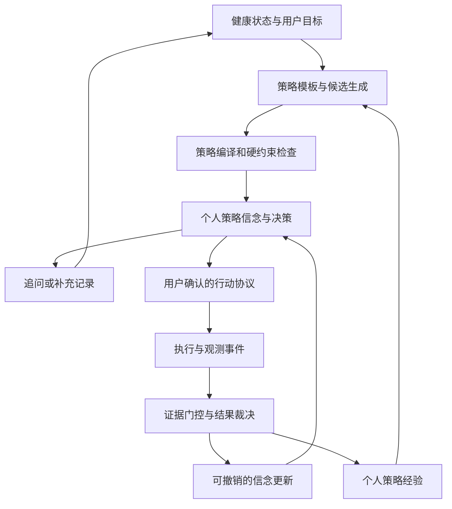
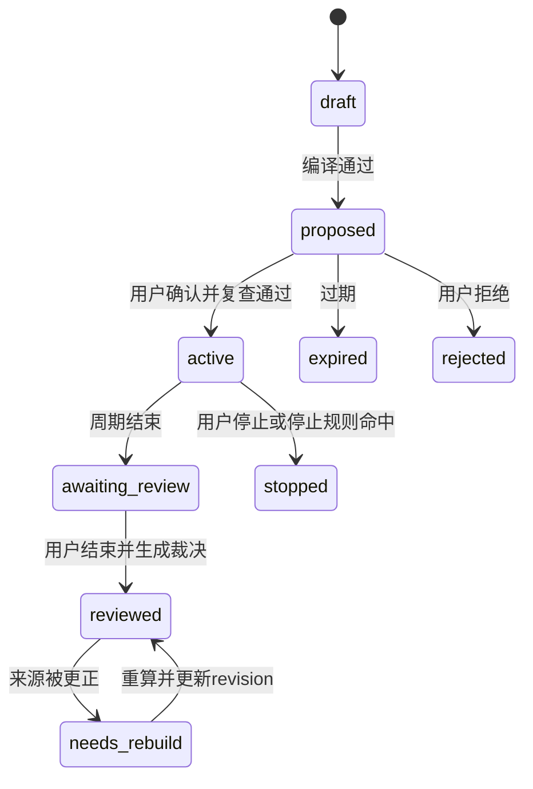

# HealthMate 证据门控的个体策略学习：算法实现与开发指导

日期：2026-10-02  
版本：设计稿 1.0；参考算法 `egpl-reference-1.0.0`  
定位：个人健康策略验证引擎的核心技术规范。

本文交付算法设计、可执行参考代码、数据与接口契约、现有项目接入方案和能力验收方法。当前工作区已经落地 WP0–WP4 的后端核心、0031/0032 增量迁移、Harness 只读工具、用户能力插件层、状态页只读展示，并新增 WP5 的冻结合成评测脚本；实际部署数据库迁移和多进程生产锁竞争仍需按部署环境验收。参考程序仅处理合成数据，不连接业务数据库，不训练大模型或视觉模型。

配套文件：

- [可执行算法参考](examples/personal_policy_learning_reference.py)
- [参考算法不变量测试](examples/test_personal_policy_learning_reference.py)
- [前序能力升级方案](HEALTHMATE_FIRST_PRIZE_CAPABILITY_PLAN_2026-10-02.md)
- [现有能力升级交付报告](HEALTHMATE_CAPABILITY_UPGRADE_DELIVERY_2026-10-02.md)

## 1. 主创新点与开发目标

主机制：**将建议编译为可检验策略单元，通过证据门控更新个人策略，再联合考虑预期收益、信息增益与执行负担，选择下一步。**

基本对象从“一条聊天建议”升级为：

> 在条件 C 下，用户执行行动 A；按照预先冻结的指标 M 和窗口 W 观察；证据满足 G 时，允许更新对这条策略的判断。

产品必须回答四个问题：

1. 这次建议基于哪些个人事实？
2. 怎样执行，怎样观察，什么时候结束？
3. 执行结果允许我们得出什么判断？
4. 这个判断怎样改变下一次选择？

本项目拟实现的贡献是策略表示、证据门控、可撤销学习和行动/取证联合决策。上下文 Bandit、Beta-Bernoulli 和信息增益是已有算法基础；不能仅因组合这些算法就宣称原创算法，性能提升也必须通过对照验证。

首版聚焦生活方式和执行策略，例如任务时长、记录复杂度、任务时间安排。医学诊断、药物、疾病治疗与安全阈值不进入学习对象。

## 2. 现有项目的落点与真实缺口

以下事实依据本次读取的工作区源码，不代表生产数据库已经升级。

| 现有模块 | 可以复用的部分 | 必须改变的部分 |
| --- | --- | --- |
| `services/health_state/` | 带证据、版本、缺失与约束的健康状态 | 将行动前状态冻结，提供可比较上下文 |
| `services/agent/experiments.py` | 基线、协议、结束窗口、真实记录读取、decision_id | 从固定五类实验转为版本化模板；更严格的证据门控 |
| `services/agent/outcome.py` | 结果事件、用户偏好、幂等入口 | 将接受、执行、目标支持拆开，旧 alpha/beta 不作为新结果信念 |
| `services/agent/decision.py` | 封闭候选集、约束过滤、可解释评分 | 学习到具体策略/版本/上下文，而非只按 Action 名统计 |
| `services/agent/action_proposals.py` | 参数白名单、确认、过期、payload_hash | 确认内容与策略协议一致；确认时重新检查状态和能力 |
| `services/agent/action_executors.py` | 执行器映射、所有权检查 | 用可靠事件驱动学习，处理内部提交与外层事务边界 |
| `harness/` | 最小工具权限、只读观察、受控写操作 | 增加策略读工具，禁止模型直接写后验与验证结论 |
| `pages/state/`、`pages/plan/`、`pages/chat/` | 下一步、计划执行、确认卡片 | 形成“正在尝试什么—结果怎样—为何调整”的连续视图 |

### 2.1 当前结果学习不能直接充当新引擎

`record_outcome()` 当前会在以下事件中增加同一组 alpha/beta：

- `accepted`：alpha 增加；
- `rejected`：beta 增加；
- `completed` 且结论不为 `insufficient_data`：alpha 增加；
- `abandoned` / `inaccurate`：beta 增加。

因此，同一统计混合了偏好、可执行性和目标观察结果。尤其是 `experiment.finish` 将 `not_supported_yet` 映射到 `completed + unchanged`，仍可能增加 alpha。它不能回答“该策略在可比条件下是否达到预设目标”。

`decision._score()` 的 `efficacy_from_history` 目前主要来自接受率与完成率；此字段不能对用户解释为健康效果。

开发要求：保留旧事件及兼容返回，将旧统计解释为行为参与统计。新增独立信念和验证事件。历史接受/完成事件不迁移成“有效策略样本”。

### 2.2 当前实验门控需要加强

`finish_experiment()` 目前主要检查后续样本大于零、必要时基线样本大于零，再看是否达到目标。新机制至少检查实际执行量、覆盖率、可比时段、指标版本、单变量约束、混杂与窗口结束。

当前 `experiment.start/finish/cancel` 在 Registry 中只允许 `source=user`，且位于 `MODEL_FORBIDDEN_ACTIONS`。接入时保持这一权限边界：Agent 可建议和解释，用户启动/结束/停止。

### 2.3 运行前提

工作区已有 0027–0030 迁移源码；实施前使用 `alembic heads` 核对当时基线。新增迁移必须接在实际单一 head 之后。此前审查发现部署库落后于源码；不得把新增模型可导入等同于部署库可使用。

能力图必须读取实时 Worker 状态；删除“未传 engine 时默认动作能力可用”的推定。过期 Worker、未审核模板、缺失测量器均应提供具体不可用原因。

## 3. 总体结构



确定性算法负责约束、证据、统计和排序；语言模型负责理解需求、提出受模板约束的候选、解释已经形成的结论。

模型生成的假设属于待验证数据。模型不能设置成功指标、改变门槛、标记证据充分、代替用户执行，或把总结文字写成新的事实。

## 4. 形式化定义

### 4.1 个人上下文

令 `s_t` 表示决策时的状态，包括用户目标、有效约束、可用时间、近期记录与正在执行的行动。

首版采用少量、可解释的离散条件，不使用高维聊天向量作为直接学习键：

```text
context_schema_version = context-v1
context = {
    time_budget: tight | open | unknown,
    recovery: normal | constrained | unknown,
    schedule: workday | restday | unknown
}
```

条件值必须带来源。缺记录时使用 `unknown`；不能推断为正常。

`context_key` 是标准化上述有限字段后的 SHA-256。不要把完整健康状态哈希作为学习桶，否则每天产生一个新桶、永远没有可重复样本。

只保留与模板有关的两到三个条件。例如记录习惯模板可以不使用恢复状态。不同目标、指标、协议版本与上下文不能直接合并后验。

### 4.2 策略单元

策略单元记为：

\[
P=(C,A,H,M,W,G,R,V)
\]

| 符号 | 含义 |
| --- | --- |
| C | 适用条件和排除条件 |
| A | 可执行行动，包含一个待改变变量 |
| H | 可以被支持或削弱的假设 |
| M | 预先登记的主要指标和方向 |
| W | 基线、执行、观察窗口 |
| G | 各类证据的更新门控 |
| R | 停止条件和复查规则 |
| V | 模板、协议、指标、算法版本 |

用户更改行动变量、观察指标或判定阈值后，需要新的协议版本和新的确认。不能继续使用原来的成功门槛。

### 4.3 学习粒度

一个 `episode` 是一次已确认协议的完整执行与观察周期。

首版每个 episode 对每个信念端点最多贡献一条二元观测。七天数据用来判断一个周期，而不是算作七个独立“策略有效样本”。确认、执行、复查和客户端重试都不能重复计数。

学习键：

```text
(user_id, strategy_id, protocol_version, metric_version, context_key, endpoint)
```

## 5. 三类信念：可执行、目标支持、证据可获得

必须分别维护：

| 信念 | 对应问题 | 更新依据 |
| --- | --- | --- |
| F：execution | 在这种条件下，这个行动是否能够按约定执行？ | 真实执行机会与明确确认的完成/未完成 |
| S：support | 在充分执行且可比较的周期中，观察是否支持预设目标？ | 通过门控的结果裁决 |
| Q：availability | 充分执行后，这种协议能否获得可用于判断的证据？ | 可比数据是否足够，包含不可判断周期 |

`accepted` 只是选择/偏好事件，不更新 F 或 S。需要时独立统计接受率。

S 是“被选择且满足门控的可比周期达到预设观察标准”的模型；不是因果效果、总体健康收益或诊断正确率。

### 5.1 Beta-Bernoulli 更新

每个信念首版使用 `Beta(1,1)` 弱先验：

\[
\theta_k\sim Beta(\alpha_k,\beta_k),\quad k\in\{F,S,Q\}
\]

存在合法标签 `y_k∈{0,1}` 时：

\[
\alpha'_k=\alpha_k+y_k,\quad \beta'_k=\beta_k+1-y_k
\]

标签为 `null` 时两者不变。

后验均值为：

\[
E[\theta_k]=\frac{\alpha_k}{\alpha_k+\beta_k}
\]

这里假设同一学习桶内的周期大致可交换。周期相关、选择偏差和缺失可能破坏该假设，必须通过上下文分桶、非重叠周期、版本隔离和模拟校准控制使用范围。不能把 Beta 可信区间解释为临床有效性可信区间。

### 5.2 首版不使用“质量分数乘后验计数”

证据质量先决定能否更新。不要随意执行 `alpha += confidence`，特别是模型自报置信度。这类加权计数改变了概率模型，不能继续宣称普通 Beta-Bernoulli 后验解释。

首版只做整数级周期更新，保留拒绝更新原因。后续若使用折扣或广义贝叶斯，需要新算法版本和单独校准。

### 5.3 不足样本的显示与使用

无个人周期：内部先验均值可以参与保守默认排序，但用户看到“暂无个人验证记录”，不能看到“有效概率50%”。

参考实现中至少三次可执行周期和三次合格目标周期才标记 `personalised=true`。这是工程展示下限，不是三次实验足以证明效果。真实发布门槛应结合可信区间宽度、实际使用周期和校准结果确定。

### 5.4 可信区间

可选地计算 Beta 后验的 5%–95% 分位区间；含义是模型内的端点不确定性。

可使用已验证的 Beta 分位数库。若不引入依赖，可用固定种子 `Random.betavariate` 采样近似分位数，并记录样本数、种子与 Python 版本；参考算法的决策路径不依赖随机可信区间。

```python
from random import Random

def beta_interval(alpha: float, beta: float, seed: int, n: int = 8192):
    rng = Random(seed)
    samples = sorted(rng.betavariate(alpha, beta) for _ in range(n))
    return samples[int(0.05 * (n - 1))], samples[int(0.95 * (n - 1))]
```

## 6. 策略编译器

### 6.1 输入与输出

输入为：已认证用户、当前目标、健康状态、经审核的策略模板、用户明确参数和来源引用。

输出为：冻结的 `PersonalStrategyUnit`，或明确缺失问题/拒绝理由。编译本身不启动行动、不修改计划。

编译顺序：

1. 检查模板可用与用户所有权。
2. 从服务端 Registry 解析指标和参数。
3. 只投影相关的上下文，保留缺失。
4. 检查一个可验证变量、可执行行动与结束条件。
5. 检查指标来源能否真实取得。
6. 冻结窗口、主要指标、方向、目标、模糊区间和门控版本。
7. 冻结基线引用与快照版本。
8. 校验硬约束、能力与当前活跃周期。
9. 标准化协议并生成 `protocol_hash`。

### 6.2 首批模板建议

以下为产品验证方向。具体行动参数、窗口与指标须在模板审核时冻结。

| 模板 | 单个改变变量 | 可执行性证据 | 主要观察指标 | 关键限制 |
| --- | --- | --- | --- | --- |
| `session_duration` | 任务时长 | 预定机会中的执行确认 | 任务主观负担或预定行为目标 | 不同时改变强度、动作和频率 |
| `record_complexity` | 每次要求填写的项数 | 是否完成约定记录 | 有效记录覆盖或主观记录负担 | 缺记录不等于健康行为未发生 |
| `task_timing` | 任务安排时间 | 按时执行确认 | 完成比例或任务负担 | 比较时长与内容一致的任务 |

首批不使用短期体重变化作为算法“收益”，也不使用未通过可比性验证的动作分数。

若完成比例本身就是主要目标，它可以成为行为结果；UI必须称“行为目标支持”，不能因为完成比例提高就称健康改善。F和S来源重叠时记录 `endpoint_dependence=true`，不要声称两个端点相互独立。

### 6.3 指标 Registry

每个指标包含：

```text
key / version / unit / direction
allowed_sources
daily_aggregation
minimum_valid_days
comparison_mode: absolute | delta
comparison_slot_rule
source_capability_requirements
value_range
```

`value_range`、聚合、方向和单位由服务端定义。自述负担是用户自述，不能标成客观传感器测量。

### 6.4 Pydantic 契约示例

下列为目标接口模型，建议放在 `backend/app/services/policy_learning/contracts.py`。字段阈值为工程示例，不代表医学阈值。

```python
from datetime import datetime
from typing import Literal
from pydantic import BaseModel, ConfigDict, Field

class StrictModel(BaseModel):
    model_config = ConfigDict(extra="forbid", allow_inf_nan=False)

class SourceRef(StrictModel):
    source_type: str
    source_id: str
    source_revision: int = Field(ge=1)
    observed_at: datetime
    metric_version: str
    evidence_type: Literal["observed", "user_confirmed", "derived"]
    trace_id: str | None = None

class MetricProtocol(StrictModel):
    metric_key: str
    metric_version: str
    mode: Literal["absolute", "delta"]
    direction: Literal["increase", "decrease"]
    target: float
    ambiguity_band: float = Field(ge=0)
    minimum_days: int = Field(ge=1, le=28)
    minimum_coverage: float = Field(gt=0, le=1)
    aggregation: Literal["median", "paired_median", "count", "fraction"]
    comparison_rule_version: str

class PersonalStrategyUnit(StrictModel):
    id: str
    user_id: int
    template_id: str
    template_version: str
    strategy_id: str
    protocol_version: str
    hypothesis: str
    changed_variable: str
    action_parameters: dict[str, int | float | str | bool]
    context_schema_version: str
    context_key: str
    context_sources: list[SourceRef]
    metric: MetricProtocol
    baseline_start: datetime | None
    baseline_end: datetime | None
    planned_start: datetime
    planned_end: datetime
    baseline_refs: list[SourceRef]
    stop_rule_ids: list[str]
    gate_version: str
    state_snapshot_hash: str
    protocol_hash: str
```

`action_parameters` 必须再按具体模板的 Pydantic schema 校验；不能因为它是一个 dict 就允许任意字段。窗口顺序、时区、模板参数范围用服务端 model validator 检查。

### 6.5 编译伪代码

```python
def compile_strategy(db, user, request, now):
    template = load_reviewed_template(db, request.template_id)
    parameters = template.argument_schema.model_validate(request.parameters)
    state = load_fresh_state(db, user.id, now)
    context = project_context(template, state, parameters)
    metric = metric_registry.require(template.metric_key, template.metric_version)
    availability = probe_required_capabilities(db, metric)
    missing = required_fields_missing(template, state, context, availability)
    if missing:
        return CompilationResult.needs_information(missing)
    protocol = freeze_protocol(template, parameters, metric, state, context, now)
    validate_single_variable(protocol)
    validate_windows(protocol)
    validate_hard_constraints(user, state, protocol)
    protocol.protocol_hash = canonical_protocol_hash(protocol)
    return CompilationResult.compiled(protocol)
```

以上伪代码中的 helper 需要按目录设计实现；可运行的数值核心在配套参考文件中。

## 7. 观测组装：将业务记录转成可验证证据

### 7.1 数据来源

优先复用已有 `DietRecord`、`ExerciseRecord`、`HealthCheckin`、计划执行和有效动作测量记录。新增主观反馈时使用单独 schema；客户端只能提交自述内容，不能提交 `supports_hypothesis=true` 或 `source_is_verified=true`。

来源校验必须由服务端完成：

- 当前用户拥有该记录。
- 记录时间位于冻结窗口内。
- 单位、数值范围、指标版本符合 Registry。
- 来源尚未删除、修订号一致。
- 派生指标的父记录可追溯。
- 同一业务记录在一个端点里只计一次。

模型识别草稿可用于提出待确认问题，不能直接成为策略有效性的观测值。确认也不自动把估算值变成准确测量；指标 Registry 应决定这种来源是否允许用于结果。

### 7.2 真实执行机会

将行动拆为冻结的 `opportunity_id`，例如某日一个预定任务：

```text
opportunity_id
scheduled_at
execution = completed | explicitly_not_completed | unknown
reported_at
source_ref
```

没有打卡是 `unknown`。明确说“今天没做”才是未完成。应用退出、通知未读、接口失败，都不能自动判失败。

### 7.3 基线和跟进的比较槽

`comparison_slot` 首版使用预登记的星期/时段。例如相邻两个七天窗口的周一晚上对周一晚上。模板必须明确这个规则；不能结束后挑最有利的几天。

每槽聚合成一个值。重复记录按 Registry 聚合，而不是提升样本量。基线和跟进不得引用同一来源行；不能跨评分/指标版本比较。

参考程序使用整型 `slot` 表达已经由适配器核实的可比时段，它不负责解析真实日期、数据库权限或来源版本。

### 7.4 窗口与时间

使用 `app/core/time.py` 的 UTC 存储和业务日工具。数据库沿用项目 naive UTC 约定，API 输出带 Z，用户时区在协议中冻结。

建议窗口为半开区间 `[start, end)`；七天周期的 `end` 是下一天零点，不是最后一天零点。预登记窗口结束后可以保留一个数据到达宽限期，但不能因此延长行动周期或增加目标机会。

## 8. 证据门控与裁决

### 8.1 全局门控

以下情况不允许给任何学习端点计入该策略的样本：

- 所有权或协议哈希不合法。
- 实际执行的策略变量与冻结协议不一致。
- 实际跟进上下文不属于学习桶。
- 周期尚未结束。

所有权错误、伪造协议哈希等非法输入应该报错。合法报告显示实际策略或条件发生变化时，返回 `incomparable` 并保留原因，而不是将变化本身当作非法请求。想学习新的上下文，需要用户确认的新策略/周期，而不是移动旧样本。

### 8.2 可执行性 F 的缺失保护

设冻结机会数为 N，完成数为 c，未知数为 m，最低执行比例为 τ：

\[
p_{low}=c/N,\quad p_{high}=(c+m)/N
\]

- `p_low >= τ`：F标签为1，即使所有未知都未完成，也达到了执行门槛。
- `p_high < τ`：F标签为0，即使未知全部完成，也达不到门槛。
- 其余：F标签为null。

这比把缺失当零或只除以已记录机会更可靠。

例：三次机会，两次完成一次未知。τ=0.8时无法判定；τ=0.6时可以判定满足。

### 8.3 目标支持 S 的门控

\[
G_S=G_{exposure}\land G_{coverage}\land G_{source}\land
G_{version}\land G_{comparison}\land G_{confounder}\land G_{stop}
\]

| 门控 | 具体规则 | 未满足后的处理 |
| --- | --- | --- |
| exposure | F标签为1且模板所需实际执行量足够 | 不更新S，不把未执行当无效 |
| coverage | 跟进有效槽数量达到数量/比例下限 | S保持不变 |
| source | 来源可追溯、版本有效、无模型虚构值 | 拒绝非法证据，合法缺失保持未知 |
| version | 指标、单位与测量定义一致 | 标不可比 |
| comparison | delta模式存在足够非重叠可比基线槽 | 标不可比或数据不足 |
| confounder | 无已知重大同时变化 | 仅报告观察变化，不更新S |
| stop | 未发生需要停止的事件 | 暂停策略，停止S更新 |

Q只在充分执行且周期可评估时更新：门控通过为1，合法但证据不足/不可比为0。没有充分执行时Q为null，不能说“这种测量方式失败”。

重要：Q失败用于理解取证困难，不等于策略无效。

### 8.4 首版观察目标判定

首版避免对五到七天的小样本输出显著性结论。采用预冻结的实际意义门槛与模糊区间，输出描述性判断。

delta模式：

\[
d_i=y^{followup}_i-y^{baseline}_i,\quad d=median(d_i)
\]

absolute模式：

\[
d=median(y^{followup}_i)
\]

数量和比例指标应使用 Registry 定义的 count/fraction 聚合，不能复用 median。配套参考程序只实现数值 median 与 paired median；生产需逐项补充 Registry 聚合器。

将方向归一：increase时 `z=d, target_z=target`；decrease时 `z=-d, target_z=-target`。

设冻结模糊带为 ε：

- `z >= target_z + ε`：S=1，`supports_observed_target`。
- `z < target_z - ε`：S=0，`target_not_supported`。
- 中间区域：S=null，`ambiguous`。

这个带宽是产品判定规则，不是统计置信区间或测量误差保证。必须冻结、版本化，并在模拟/真实观察数据中校准。

“目标未得到支持”仅削弱在相似条件下继续采用该方案的排序；不能写成“这项行动对你无效”。

### 8.5 结果枚举与更新表

| 情况 | F | S | Q | 主结论 |
| --- | --- | --- | --- | --- |
| 用户仅接受提案 | null | null | null | pending |
| 周期未结束 | null | null | null | pending |
| 明确执行不足 | 0 | null | null | insufficient_exposure |
| 执行是否足够不明 | null | null | null | insufficient_data |
| 执行充分、数据缺失 | 1 | null | 0 | insufficient_data |
| 执行充分、基线不比或存在混杂 | 1 | null | 0 | incomparable |
| 数据可用、结果位于模糊带 | 1 | null | 1 | ambiguous |
| 合格观察达到冻结标准 | 1 | 1 | 1 | supports_observed_target |
| 合格观察未达到冻结标准 | 1 | 0 | 1 | target_not_supported |
| 实际策略或跟进上下文变化 | null | null | null | incomparable |
| 需要停止的事件 | 按合法执行证据 | null | null | stopped |

服务端可派生兼容的旧结论字段，但新学习只能使用新裁决标签。

### 8.6 进阶统计比较的边界

有足够连续周期后，可新增按天/周期分块的 bootstrap，评估描述性变化稳定性。不能逐帧或逐条记录独立重采样、忽视时间相关。

需要验证“行动造成了改善”时，必须另行设计可比较的交叉/随机安排、处理携带效应、记录分配概率并预先设分析协议。普通前后观察和Beta更新不具备这些能力。

## 9. 决策算法：收益代理、信息增益、执行负担

### 9.1 先形成合法候选集合

\[
\mathcal A_{allowed}(s_t)=\{a: constraint(a,s_t)=pass\}
\]

过滤条件：用户排除、模板未审核、能力未上报、已有活跃周期、过期协议、缺少必需信息、停止锁定、不可用动作测量器等。

硬约束不进入收益权重，不能由高后验或高信息增益抵消。

### 9.2 样本不足的收缩

为避免一次好结果主导长期排序，使用：

\[
\kappa=n_S/(n_S+k_0)
\]

\[
\tilde p_S=(1-\kappa)p_{S,0}+\kappa E[\theta_S]
\]

参考值 `p_S,0=0.5, k0=3`，均为版本化工程默认。`n_S`是合格周期数，不是确认数或观测日数。

### 9.3 收益代理

\[
V(a|s)=relevance(a,s)\ E[\theta_F]\ \tilde p_S
\]

此式是用于候选排序的代理，表达能够执行并支持已登记目标的倾向；不是健康效用单位。首版不声称F/S独立或该乘积已经校准。

只比较同一个用户当前目标下可替代的候选。不同指标的支持概率不能直接当作相同价值；`relevance`与模板目标归一规则需冻结。跨目标先用用户选择/确定性优先规则分组，再在组内排序。

### 9.4 端点信息增益

对于Beta-Bernoulli端点：

\[
I(\theta;Y)=H_{Bernoulli}(p)-E_{\theta}[H_{Bernoulli}(\theta)]
\]

其中：

\[
p=\alpha/(\alpha+\beta)
\]

\[
E[H_{Bernoulli}(\theta)]=
\psi(\alpha+\beta+1)-p\psi(\alpha+1)-(1-p)\psi(\beta+1)
\]

ψ是digamma函数。单位为nats，以 `ln(2)` 归一。参考实现提供数值计算；`Beta(1,1)`应得到 `ln(2)-0.5≈0.193147` nats。

行动的信息增益代理：

\[
I_a=E[\theta_F]E[\theta_Q]\ I(\theta_S;Y_S)/\ln2
\]

即行动需要执行，结果还需要能获得证据，信息才能进入S更新。

该乘积忽略了周期长度、端点依赖和部分拒判机制，是首版近似。它衡量参数信息量；不是原始IDS中关于“最优行动”的互信息，也不继承IDS的遗憾界。后续可以使用模板持续时间折扣与模拟校准，但必须新版本发布。

### 9.5 排序

\[
U(a|s)=V(a|s)+\lambda I_a-\mu C(a,s)
\]

- C为0–1归一的执行负担，来源为审核默认或用户明确反馈。
- λ默认0；只有用户授权低风险试行模式才开启，参考值0.15。
- μ参考值0.35。
- 同分按稳定candidate_id排序，保证可重放。

`argmax U`只提出候选，用户仍需确认。开启信息增益并不授权后台随机执行。

全部不合法、没有正向代理或信息不足时，返回 `collect_evidence_or_wait`，具体追问/等待原因由证据缺口规则给出。

### 9.6 冷启动

首版流程：

1. 读取明确偏好和硬约束。
2. 信息缺失先问一个会影响合法候选集合的问题。
3. 使用审核默认、低负担候选。
4. 明确显示尚无个人验证依据。
5. 获得完整周期后再开始端点更新。

不训练跨用户模型，不将其他用户的记录作为这个人的已验证事实。未来使用群体先验必须取得数据授权、记录来源、限制先验强度并单独验证。

### 9.7 主动追问与EVSI：分阶段实现

V1先做确定性缺口选择：按“是否影响合法性/行动选择”排序；每轮最多一个问题，不反复问已知信息。等待也是有效输出。

V2在回答分布可校准时，令 `J(a,s)=V(a,s)-μC(a,s)` 表示不含信息奖金的净行动价值代理，计算期望样本信息价值：

\[
EVSI(q)=\sum_z p(z|q,s)\max_{a\in\mathcal A_{allowed}(s,z)}J(a,s,z)-\max_{a\in\mathcal A_{allowed}(s)}J(a,s)-C_q
\]

追问q在 `EVSI>0` 且询问预算允许时优先。候选集合也随回答更新，并将“等待/不行动”作为价值为0的合法候选，避免空集合的最大值未定义。为避免重复计算信息收益，此式使用净行动价值J，不能再次叠加同一问题带来的信息奖金。它仍依赖本文的代理价值与回答模型，不是已经校准的真实健康效用。

回答概率来自可验证历史/明确离散先验，并记录出处；模型自报“70%会这样回答”不能直接使用。追问用户时间预算揭示上下文，不会自动更新S后验。

V1配套程序只实现行动排序及拒判出口，没有实现EVSI。这一界限必须在交付说明中保留。

## 10. 可撤销的学习与条件记忆

### 10.1 将裁决当作可重建事件

每个周期裁决生成：

```text
episode_id
revision
protocol_hash
context_key
execution_label / support_label / availability_label
conclusion
gate_reasons
evidence_refs + source_revisions
valid / superseded / revoked
algorithm_version / gate_version
```

同一episode最新有效revision才参与后验。同revision相同内容幂等；同revision不同内容冲突；旧revision拒绝覆盖。

### 10.2 重建公式

令E为当前学习桶的有效裁决集合：

\[
\alpha_k=1+\sum_{e\in E}1[y_{e,k}=1]
\]

\[
\beta_k=1+\sum_{e\in E}1[y_{e,k}=0]
\]

可运行参考Ledger每次按有效集合重建。在生产中维护物化缓存，但以裁决集合为真相来源。

### 10.3 来源更正/删除

源记录变化后：

1. 原子写入业务变更和outbox事件。
2. 通过来源引用查找受影响episode。
3. 将相关裁决标为stale，立即停止其正向影响。
4. 读取最新来源并重新裁决，revision加一。
5. 按最新有效集合重建F/S/Q。
6. 使策略记忆与决策缓存失效。

例如原来 `Beta(2,1)`的正向S被更正为负向，只能成为 `Beta(1,2)`；不能变成`Beta(2,2)`。更正后证据不足则恢复先验/剩余有效计数。

立即失效需要可靠的域级generation：记录写事务增加用户对应数据域版本。读决策时若版本未被处理，暂时忽略旧信念，避免队列延迟继续使用错误结论。

### 10.4 个人策略经验的内容

```json
{
  "strategy_id": "session_duration_short",
  "context": {"time_budget": "tight", "schedule": "workday"},
  "protocol_version": "1.0.0",
  "metric_version": "burden-v1",
  "eligible_execution_episodes": 4,
  "eligible_support_episodes": 3,
  "conclusion_scope": "observed_target_under_comparable_conditions",
  "failure_reasons": ["insufficient_exposure", "missing_followup"],
  "valid_until": "2026-11-01T00:00:00Z",
  "evidence_ids": ["adjudication-1", "adjudication-2"],
  "influential": true
}
```

示例数字为说明数据结构的合成值，不是项目真实效果。

显式偏好、事实约束、策略证据分开存储。用户说“不喜欢晚上运动”是偏好；发生疼痛是需要处理的事实；某种安排多次通过验证是策略证据。

### 10.5 漂移与遗忘

V1用上下文隔离、非重叠周期和固定有效期限，过期后重新验证。不要在每日请求中重复对alpha/beta打折。

当任务时间、器材、目标或用户条件改变时：旧策略仍可查询，但在新条件下不直接标为有效。新条件重新冷启动。未来若采用指数衰减，必须按事件发生时刻重新计算有效贡献，使用新的近似模型解释和校准。

## 11. 生命周期与行动执行

### 11.1 周期状态机



定时器将到期周期标为待复查，是已授权周期的派生状态；不能借此启动下一周期或替用户应用新计划。

证据计算是只读函数；将裁决持久化、结束周期仍通过有权限的服务命令。自动停止可以缩小已授权范围，但不得据此自动开启替代行动。

### 11.2 与旧微实验共存

首版可以建立新`policy_episode`与旧`AgentMicroExperiment`的一对一适配关系，但同时只有一个底层执行周期和一个学习入口。

旧五类experiment继续使用原接口。新协议如果无法由旧schema准确表达，就通过新增`policy.episode.*` Action执行，不强塞入旧的`gentle/standard`参数。

同一用户新旧周期共用一个active-slot锁，阻止两边分别“检查没有活跃任务”后同时启动。

### 11.3 新Action目标契约

| Action | 参数 | 发起来源 |
| --- | --- | --- |
| `policy.episode.start` | strategy_unit_id、protocol_hash、version | user |
| `policy.episode.finish` | episode_id、version | user |
| `policy.episode.stop` | episode_id、version、reason_code | user |
| `policy.memory.reset` | strategy_id可选、scope、version | user |

Registry、参数schema、执行器和`MODEL_FORBIDDEN_ACTIONS`同步登记。Agent读工具只能返回候选策略id；实际创建待确认提案来自用户触发的业务接口。

### 11.4 确认时的检查

- 用户所有权、提案version、payload_hash与protocol_hash一致。
- 指标、窗口、模板仍有效。
- 当前状态不违反硬约束。
- 必要能力仍在线，来源generation未漂移。
- 基线和计划内容仍是用户看到的版本。
- 没有新旧系统的另一活跃周期。

若协议、目标或计划差异需要改变，返回409要求重新展示与确认。不得“确认时重算出不同计划后直接应用”。只是状态哈希变化、实际内容和合法性不变时，记录复查结果即可。

### 11.5 事务与outbox

现有`propose_action()`、若干执行器和`record_outcome()`会内部commit。新事务不能把这些函数直接嵌入`with db.begin()`并声称整体原子性。

建议新增transaction-aware底层方法，仅`flush()`；HTTP/service边界统一commit。兼容旧入口时保留其外层提交行为。

```python
def finish_policy_episode(db, user_id, episode_id, expected_version):
    with db.begin():
        row = load_owned_episode_for_update(db, user_id, episode_id)
        assert_version(row, expected_version)
        assert_ready_for_review(row)
        evidence = assemble_evidence(db, row)
        verdict = adjudicate_evidence(row.protocol, evidence)
        save_adjudication(db, row, verdict)  # flush, no inner commit
        row.status = "reviewed"
        row.version += 1
        enqueue_outbox(db, "policy.adjudicated", row.id, verdict.revision)
    return episode_view(row)
```

使用唯一outbox事件保证裁决最终进入学习。消费者失败可重试；不采用吞异常后永久丢失学习更新的best-effort模式。

## 12. 数据库开发设计

以下均为拟新增表；迁移只写新revision，实际命名以实施时的迁移head为准。

| 表 | 核心字段 | 唯一键/索引 |
| --- | --- | --- |
| `policy_templates` | template_id、template_version、status、protocol_json、source_ids、reviewed_at、hash | template_id+version |
| `personal_strategy_units` | id、user_id、template_version、context_key、protocol_json、protocol_hash、state_hash、created_at | id；user+created_at |
| `policy_episodes` | id、user_id、unit_id、legacy_experiment_id、decision_id、learning_epoch、status、start_at、end_at、version、review_revision、effective_adjudication_revision | id；legacy_experiment_id可空唯一；user+status |
| `policy_execution_opportunities` | id、user_id、episode_id、scheduled_at、slot、frozen_action_json、current_report_id | episode+slot；id |
| `policy_reports` | id、client_report_id、user_id、episode_id、opportunity_id、revision、execution、burden、confounders_json、received_at、source_version | opportunity+revision；user+client_report_id |
| `policy_observation_refs` | user_id、episode_id、endpoint、slot、source_type、source_id、source_revision、value_json、observed_at、valid | episode+endpoint+slot；user+source_type+source_id |
| `policy_adjudications` | user_id、episode_id、revision、learning_epoch、labels_json、reasons_json、source_hash、algorithm_version、valid | episode+revision |
| `personal_policy_beliefs` | user、strategy、protocol_version、metric_version、context_key、endpoint、learning_epoch、alpha、beta、counts、generation、valid_until | 完整学习键+learning_epoch |
| `policy_decisions` | id、user_id、state_hash、belief_generation、candidate_json、selected_id、policy_mode、propensity_json、config_hash、created_at | id；user+created_at |
| `policy_outbox` | event_id、user_id、event_type、ref_id、revision、payload、status、attempts、next_retry_at | user+event_type+ref_id+revision |
| `policy_active_slots` | user_id、episode_kind、episode_id、version | user_id唯一 |
| `policy_domain_generations` | user_id、domain、source_generation、processed_generation | user+domain |
| `policy_learning_controls` | user_id、scope_key、epoch_counter、learning_enabled、reset_at | user+scope_key |

`context_key`使用固定64字符哈希，避免MySQL长复合索引；模板文本与原始context保存在JSON/Text而不进入索引。SQLAlchemy JSON或Text的选择需要同时验证SQLite与MySQL。

### 12.1 必须具备的数据库约束

- 同一episode/revision只存在一条裁决。
- `effective_adjudication_revision`是周期当前有效裁决的唯一指针；在锁定周期行的事务内推进。仅指针指向且非stale的裁决进入重建，不能只用多行`valid=true`推定唯一有效。
- 学习键唯一。
- alpha/beta有限且不小于先验。
- 所有个人表的user_id不能为空。
- 活跃槽通过唯一行/锁和事务释放，不依赖应用先查后写。

MySQL使用行锁与唯一键；SQLite使用相应写事务/唯一键验证。不要假设`FOR UPDATE`在SQLite下提供同样语义。

`client_report_id`在报告表中实际落为不可空字段；相同id和相同内容返回原结果，相同id不同内容返回409。新report_id更正同一机会时递增revision并替换`current_report_id`，不会新增一个执行机会。个人表之间的外键还需校验user_id一致，不能仅校验父id存在。

### 12.2 来源记录缺少revision时

已有`DietRecord.version`可复用。其他来源没有revision的，必须新增行版本或统一source-version表。`updated_at`毫秒时间、客户端时间和内容hash均不能独自代替并发修订计数。

修改/删除源记录、推进generation、写outbox应在同一个业务事务内完成。Health State原有best-effort失效继续用于兼容显示，但不能作为新学习链路唯一可靠事件。

### 12.3 历史迁移规则

1. 不复制旧`ActionPolicyStat.alpha/beta`。
2. 旧ActionOutcome保留为行为事件。
3. 旧实验可显示原结论与版本；数据不全时标`legacy_observational`。
4. 只有冻结协议、来源、执行量和门控都足够的历史周期才能申请离线再裁决；默认不自动回填。
5. 再裁决输出新事件和新版本，保留历史报告。

### 12.4 删除与重置

账户删除和导出需覆盖全部个人策略表、冻结的个人协议/证据、decisions、outbox和belief缓存。公共审核模板与个人数据分开。

用户可以停止一个周期、删除个人策略记忆、关闭学习、重置后验。重置应明确范围，立即推进generation并禁止被后台旧事件自动恢复。若保留源记录用于用户账本，增加reset cutoff或generation隔离，避免消费者重放重新学出已删除记忆。

建议以`policy_learning_controls`保存全局和指定strategy的控制计数。`learning_epoch`为当前全局计数与该strategy计数的规范化哈希：全局重置推进全局计数，指定策略重置只推进该策略计数。episode启动时冻结epoch，裁决和outbox保留它；消费者与查询只能使用和当前控制值一致的epoch。旧周期可以保留可查询结果，但不能因晚到事件再次恢复已清除的学习。关闭学习还需在写入和消费入口共同检查，不只隐藏前端。

## 13. 服务目录与职责

```text
backend/app/services/policy_learning/
  contracts.py         # 请求、协议、裁决、信念、决策类型
  template_registry.py# 经审核模板与指标定义
  compiler.py          # 参数、窗口、单变量与协议冻结
  context.py           # 条件投影、来源、分桶与漂移
  observations.py      # 业务记录->可比证据槽
  gates.py             # 分端点证据门控
  adjudicator.py       # 确定性标签与原因
  beliefs.py           # 按有效事件重建三类信念
  information.py       # 信息增益、未来EVSI
  selector.py          # 过滤、收益代理与排序
  runtime.py           # 周期状态与Action执行器
  repository.py        # 所有权、版本、唯一键和锁
  outbox.py            # 可靠消费与重试
  memory.py            # 条件化、带证据的策略经验
  invalidation.py      # 来源更正、删除与generation
  evaluation.py        # 模拟、回放与消融

backend/app/api/v1/policy.py
backend/app/harness/policy_tools.py
backend/tests/test_policy_*.py
benchmark/policy-learning-v1/
```

参考程序只包含纯算法核心。工作区生产代码已另外提供鉴权、SQL、异步 outbox、模板 Registry、HTTP 和前端只读接入；生产实现仍不能直接把内存参考程序当持久化服务。

### 13.1 核心函数契约

下面是已落地函数与其生产边界。请求入口、纯函数与事务命令必须分开；函数名称是实现契约，内部细节可在不改变契约的情况下演进。

| 函数 | 输入 | 输出与约束 |
| --- | --- | --- |
| `compile_strategy` | 当前用户、模板版本、参数、最新状态、当前时间 | `CompilationResult`：compiled / needs_information / rejected；不启动行动 |
| `project_context` | 审核模板、状态、参数 | 有限context、context_key、SourceRef；缺失保留unknown |
| `assemble_evidence` | 当前用户、冻结episode、来源读取器 | `EvidenceBundle`：机会、聚合槽、来源revision、generation、混杂、停止事件 |
| `adjudicate_evidence` | 冻结协议、EvidenceBundle | `Adjudication`：F/S/Q标签、结论、原因、来源hash；纯函数，无SQL和模型调用 |
| `rebuild_beliefs` | 完整学习键、最新有效裁决集合、learning_epoch | `BeliefSet`及计数；只能重建当前epoch，过期/撤销/stale记录不参与 |
| `rank_candidates` | 已校验候选、信念快照、约束、决策配置、授权状态 | `Decision`：候选排序或取证/等待；不写计划、不执行行动 |
| `start_policy_episode` | 当前用户、已确认提案、expected_version | 原子取得新旧共享active-slot并保存冻结机会；冲突409 |
| `finish_policy_episode` | 当前用户、episode_id、expected_version | 保存裁决、有效指针和outbox；一次提交，不内嵌commit |
| `apply_source_revision` | 来源域、记录id、revision、删除标志、用户 | 更新generation、定位受影响周期、标stale和安排重算；幂等 |
| `consume_policy_event` | outbox event_id | 锁定范围并重建、推进processed_generation；旧revision/epoch不能回写 |

`EvidenceBundle`至少带`episode_id`、`protocol_hash`、`context_key`、`window_closed`、`execution_opportunities`、`baseline_slots`、`followup_slots`、`source_refs`、`domain_generations`、`confounder_codes`、`stop_events`。`Decision`至少带版本、config_hash、state_hash、belief_generation、合法/过滤候选、各打分分项、所选候选、真实propensity、解释引用和缺失项。

测试时给纯函数传固定时间/冻结数据；HTTP层负责认证和输入校验，repository负责所有权与锁，runtime负责事务，语言模型不得穿透这些边界。

## 14. API设计

前缀：`/api/v1/policy`。所有user_id从current_user取得，客户端不得指定其他用户。

| 方法/路径 | 功能 | 业务副作用 |
| --- | --- | --- |
| GET `/templates` | 当前可用模板和限制 | 只读 |
| POST `/compile` | 校验并保存候选策略单元 | 仅提案元数据，不启动行动 |
| POST `/decide` | 冻结一次候选决策并返回理由 | 决策审计，不执行行动 |
| POST `/units/{id}/proposal` | 用户触发创建待确认启动提案 | 待确认 |
| GET `/episodes/current` | 当前周期与数据缺口 | 只读 |
| GET `/episodes/{id}` | 协议、进度、观察与裁决 | 只读 |
| POST `/episodes/{id}/reports` | 执行确认、负担自述、混杂报告 | 记录用户明确输入 |
| POST `/episodes/{id}/review-preview` | 当前证据的只读裁决预览 | 不冻结、不更新后验 |
| POST `/episodes/{id}/finish-proposal` | 创建结束待确认提案 | 待确认 |
| POST `/episodes/{id}/stop-proposal` | 创建停止提案 | 用户确认后停止 |
| GET `/strategies/{id}/memory` | 条件化个人证据与影响范围 | 只读 |
| POST `/memory/reset-proposal` | 申请重置策略记忆 | 用户确认后重置 |
| GET `/decisions/{id}` | 重放一次决策依据 | 只读 |

提案确认、拒绝继续使用已有`/agent/actions/{proposal_id}/confirm|reject`，避免再创建一套确认协议。

### 14.1 编译请求

```json
{
  "template_id": "session_duration",
  "template_version": "1.0.0",
  "parameters": {"variant": "short"},
  "goal_key": "make_plan_sustainable"
}
```

参数值须通过模板schema。用户不能在此上传判定门槛或关闭停止规则。

### 14.2 决策响应

```json
{
  "decision_id": "pd_example",
  "algorithm_version": "egpl-v1",
  "policy_mode": "deterministic_heuristic",
  "kind": "propose_action",
  "strategy_unit_id": "su_example",
  "requires_user_confirmation": true,
  "personalised": false,
  "evidence_used": [],
  "evidence_missing": ["personal_eligible_episode"],
  "explanation": "目前还没有个人验证记录，先选择符合你时间条件的低负担方案。",
  "filtered": [],
  "selection_propensity": 1.0,
  "config_hash": "example-only"
}
```

示例均为接口说明。内部统计与打分可放入授权debug视图，普通UI保留可理解的原因与证据天数。

### 14.3 用户报告请求

```json
{
  "episode_version": 2,
  "report_id": "client-generated-unique-id",
  "opportunity_id": "op_example",
  "execution": "completed",
  "perceived_burden": 4,
  "confounder_codes": []
}
```

后端将原子用户报告归档并关联机会。用户可以补充/更正报告，但必须形成新revision和明确审计；不同report_id不能给同一机会增加第二次完成。

### 14.4 错误语义

| 状态码 | code | 含义 |
| --- | --- | --- |
| 404 | POLICY_NOT_FOUND | 不存在或非当前用户 |
| 409 | POLICY_PROTOCOL_CHANGED | 当前协议与确认内容不一致 |
| 409 | POLICY_VERSION_CONFLICT | 并发修订冲突 |
| 409 | POLICY_EPISODE_ACTIVE | 新旧系统已有活跃周期 |
| 409 | POLICY_NOT_READY | 窗口未结束 |
| 410 | POLICY_PROPOSAL_EXPIRED | 提案已过期 |
| 422 | POLICY_UNVERIFIABLE | 无法编译为可检验策略 |
| 422 | POLICY_EVIDENCE_INVALID | 非法来源、范围或版本 |
| 503 | POLICY_REQUIRED_CAPABILITY_OFFLINE | 实际能力不可用 |

“数据不足”通常是合法的200结果，而非服务异常。接口报错与无法下结论需分别展示。

## 15. Harness接入

新增只读工具：

| Tool | 用途 |
| --- | --- |
| `policy.templates.read` | 读取适用模板和缺失条件 |
| `policy.candidates.preview` | 在现有证据下计算候选，不启动行动 |
| `policy.episode.read` | 引用当前协议、执行量和结果 |
| `policy.evidence.read` | 读取门控原因与来源引用 |
| `policy.memory.read` | 查询条件化策略经验 |
| `policy.decision.explain` | 解释已保存决策的变化原因 |

不提供 `policy.posterior.write`、`policy.mark_success` 或让模型输入数字奖励的工具。

计划/运动/恢复Agent按需读取上述工具。多Agent可共同解释同一决策，但只能有一个服务端策略选择器产生最终候选和行动协议。

最终答复必须绑定 `decision_id` / `episode_id` / `protocol_version`。外部文字和模型总结保持`content_is_data`，不能修改门控配置。

## 16. 小程序产品接入

首版优先复用已有页面，开发逻辑如下：

1. “状态与下一步”：显示一个当前候选、理由、尚缺信息、查看/确认入口。
2. “计划”：显示正在尝试的协议、冻结的机会、明确完成/未完成/未知。
3. “小管家”：引用具体周期，解释变化，展示既有Action确认卡。
4. “周期结果”：展示执行情况、观察目标、证据不足原因、下一步。
5. “策略经验”：展示适用条件、有效周期数、失败/缺失原因、记忆控制。

用户文案示例：

- “这周先试一个更短的安排，结束后看看是否更容易完成。”
- “你完成了行动，但跟进记录不足，目前不能判断这次目标。”
- “这次没有达到预设目标，下次会降低这套安排的优先级。”
- “最近条件改变了，之前的结果暂时不直接用于本次安排。”

不显示未经校准的“有效率87%”。不把rank_score、Beta均值或模型候选分转换成用户信任程度。

接口逻辑测试重点是确认内容一致、重复提交幂等、缺失/异常分开、数据更正后刷新。UI动效与真机兼容不属于本文能力验收范围。

## 17. 可运行参考程序：范围、命令与结果

参考代码路径：`docs/examples/personal_policy_learning_reference.py`。

实现内容：

- 版本/上下文隔离的Scope。
- 独立F/S/Q Beta信念。
- 缺失执行的上下界判定。
- 非重叠、同版本、同条件与单变量证据门控。
- median/paired median目标判定与模糊区间拒判。
- revision幂等、更正替换、删除重建。
- digamma与Beta-Bernoulli信息增益。
- 硬约束过滤、保守收缩、可重放行动排序。

运行命令（仓库根目录）：

```powershell
.\backend\.venv\Scripts\python.exe docs\examples\personal_policy_learning_reference.py
.\backend\.venv\Scripts\python.exe -m unittest discover -s docs\examples -p "test_personal_policy_learning_reference.py" -v
```

也可使用任意支持所用语法的Python 3.12+解释器；程序仅用标准库。

本次验证：22项参考算法测试通过。示例输入均为合成，不代表真实用户结果或生产能力达标。

示例一个正向合格周期后，F/S/Q均为`Beta(2,1)`，但仍标记`personalised=false`；不存在一次观察就声称已了解用户的跳跃。

### 17.1 参考实现与生产实现之间的边界

| 项目 | 参考程序 | 生产必须补充 |
| --- | --- | --- |
| 来源 | 调用方组装Point | 鉴权、版本、真实日期、单位核实 |
| 学习 | 内存Ledger重建 | SQL唯一键、事务、outbox、generation |
| 比较 | median/paired median | 每个指标独立聚合器 |
| 约束 | 已校验bool输入 | 服务端状态、能力、停止规则验证 |
| 主动取证 | collect_evidence_or_wait出口 | 缺口排序，未来EVSI |
| 信息增益 | 参数信息量代理 | 时长/依赖/校准验证 |
| 效果 | 观察目标支持 | 无因果保证；若需因果另设试验协议 |

## 18. 评测：证明核心机制，而非统计测试数量

### 18.1 冻结数据格式

建立`benchmark/policy-learning-v1/`：

```text
cases.jsonl              # 协议+合法/非法证据+预期门控
synthetic_users.jsonl    # 合成用户的真实参数和上下文规则
simulation_config.json  # seed、周期数、缺失/漂移机制
split.json              # 调参/验证/最终评测隔离
README.md               # 场景、假设、局限、哈希
```

包括明确成功、明确未达目标、未执行、未知执行、数据稀疏、条件漂移、指标改版、混杂、多变量、更正、删除、重试与停止事件。

### 18.2 算法对照

| 版本 | 策略 |
| --- | --- |
| B0 | 审核固定默认排序 |
| B1 | 按接受率排序，对应旧行为学习思路 |
| B2 | 单一奖励Bandit，完成与支持混合 |
| B3 | F/S/Q分开，使用门控但无信息奖金 |
| B4 | 完整门控、可撤销学习、信息增益代理 |

所有版本面对相同合法候选、相同用户场景和同等询问/执行预算。模型、提示词和识别模块保持一致，用来隔离策略机制的贡献。

### 18.3 消融实验

分别移除门控、上下文、模糊区间、来源更正回撤、Q和信息奖金。检查是否导致假阳性支持增加、错误记忆持续、询问负担增加或选择性能退化。

### 18.4 指标定义

| 指标 | 计算/含义 |
| --- | --- |
| 非法行动提议率 | 提议不满足硬约束的数量/全部提议 |
| 不合格S更新率 | 门控不通过仍更新S的数量/门控不通过周期 |
| 已更正证据残留 | 更正处理完成后旧贡献仍影响排序的数量 |
| 正确拒判率 | 预期数据不足/不可比的场景中正确保持未知的比例 |
| 个体选择代价 | 合成环境中相对合法oracle的累计收益差 |
| 目标支持率 | 合格周期中的预设目标支持；同时报告所有启动周期数 |
| 数据覆盖 | 合格周期数/启动周期数，不能只报“接受样本成功率” |
| 询问负担 | 每轮/每周期问题数及用户答复成本 |
| 冷启动代价 | 学到合理排序所需周期和累计执行负担 |
| 漂移恢复 | 条件改变后不再复用过期策略的速度 |
| 可信区间覆盖 | 合成已知端点参数在模型区间内的频率 |

收益差是在已知参数模拟环境中的诊断指标，不是理论遗憾界。真实用户没有oracle，不能输出“真实regret”。

### 18.5 防止模拟自证

至少包含：

- 低负担但无观察目标收益的方案。
- 用户喜欢但很难执行的方案。
- 可执行但记录经常缺失的方案。
- 结果好的时候更愿意记录的非随机缺失。
- 假设错误、目标不同、上下文变化与端点相关。
- 长周期延迟、重复来源和数据补录。

使用多个冻结随机种子，以用户为单位计算区间，不能把一天或一帧当一个独立用户。调参集和最终报告分离，保留失败场景。若B4不优于B3，应保留更简单的无信息奖金版本。

### 18.6 离线回放和反事实评估

确定性V1日志的推荐概率是选中候选1、其他0。它可以验证重放一致性，不能用IPS估计未选行动。

如果后续启用有授权的低风险随机推荐模式，必须记录候选集合、真实推荐概率、随机种子、用户最终选择和override。随机推荐不等于随机执行，用户覆盖选择后的执行概率不能伪造。

只有概率有支持、奖励可观测、时间和选择假设合理时，才考虑IPS/双重稳健估计；否则报告描述性或模拟结果。不要把普通排序softmax当成实际propensity。

### 18.7 发布门禁与研究指标

必须全部通过的工程不变量：

- 跨用户读写/学习串桶为0。
- 未确认行动执行为0。
- 不合格证据S更新为0。
- 缺失自动判有效为0。
- 同周期重复计数为0。
- 更正/删除重建结果与从头重放一致。
- 硬约束不可被后验或信息奖金覆盖。
- 没有足够个人证据时不显示已个性化验证。

算法性能没有预填“已达标”数字。通过冻结模拟和真实行为观察后报告效果、区间和局限。

## 19. 生产测试清单

### 19.1 纯算法

- Beta更新与解析信息增益的已知数值。
- F缺失上下界在阈值附近的行为。
- S方向、单位、负向改善、模糊带。
- 独立端点更新；目标未达不得增加S-alpha。
- 版本/上下文隔离；一次周期仅一个端点贡献。
- 来源去重、前后不重叠；NaN/Inf拒绝。
- 更正、撤回、重置后重放一致。
- 信息奖金只在授权时生效。

### 19.2 HTTP与持久化

- 真实HTTP业务入口完成编译、提案、确认、记录、复查、学习。
- 相同启动/完成回调重放只产生一次业务执行。
- 同revision不同payload为409。
- 并发两次启动只成功一次，新旧experiment共同检查。
- 确认时协议/约束变化不会暗改已确认内容。
- 源记录编辑触发generation/outbox，消费者离线时决策不读stale信念。
- outbox重试不重复后验；事件顺序颠倒不覆盖新revision。
- 导出/删除覆盖新表；重置后旧事件重放不会恢复旧记忆。

### 19.3 演练命令

实施业务代码后按风险范围运行：

```powershell
# backend目录
.\.venv\Scripts\python.exe -m pytest tests/test_policy_learning.py tests/test_state_invalidation_wiring.py tests/test_api_contract_governance.py -q
.\.venv\Scripts\python.exe scripts/audit_openapi.py
.\.venv\Scripts\python.exe scripts/audit_migration_head.py
.\.venv\Scripts\python.exe scripts/audit_privacy_coverage.py
```

`backend/tests/test_policy_learning.py` 已覆盖纯门控、聚合器、缺失保护、硬约束和最小 HTTP 闭环；`backend/tests/test_policy_runtime.py` 已覆盖旧微实验互斥、outbox 幂等、全局重置隔离和隐私导出清单；`benchmark/policy-learning-v1/run_benchmark.py` 已覆盖 B0–B4 固定合成案例。真实多进程数据库锁竞争和生产数据库迁移仍需在部署环境验收。能力效果与单测通过数分别报告。

## 20. 实施工作包

### WP0：校正语义与接入前提（已落地代码基线）

交付：旧统计字段的准确语义；新旧事件映射；Worker实时能力来源；迁移基线核对。

完成条件：接受/完成不再被解释为目标效果；没有Worker时策略选择不可假设测量可用。

### WP1：策略单元与编译（已落地）

交付：三类审核模板、Metric Registry、Pydantic契约、compiler、协议hash。

完成条件：模型任意参数不能绕过模板；不可验证的建议返回具体问题；结果标准无法后改。

### WP2：证据与纯裁决（已落地核心）

交付：实际执行机会、SourceRef版本、比较槽、F/S/Q gates、结果判定。

完成条件：同一输入输出一致；缺失、混杂、多变量和改版保持正确拒判。

### WP3：可撤销学习（已落地核心）

交付：事件表、三个信念端点、revision、outbox、generation、更正重算、记忆控制。

完成条件：更正/删除/重置可从头复现；不因重试或失败丢失更新。

### WP4：决策与用户闭环（已落地最小闭环）

交付：候选过滤、默认排序、信息增益可选项、缺口问题、Action接入、页面流程。

完成条件：一个用户可以连续完成“提出—确认—执行—观察—复查—下次改变”，且每次改变有真实依据。

### WP5：验证机制的竞争力（合成基线已落地，业务集成待补齐）

交付：冻结模拟、B0–B4对照、消融、失败案例、报告hash与局限。当前已提交 `benchmark/policy-learning-v1/` 的固定案例、运行器和两种消融入口。

完成条件：有证据说明门控、回撤或条件化记忆解决了哪些错误；算法有无改善都如实报告。当前 B0–B4 合成检查全部通过，真实业务闭环评测尚未宣称完成。

### WP6：进阶取证与选择

可选交付：EVSI主动追问、延迟反馈、经授权的随机推荐、更多真实行为窗口。

前提：WP1–WP5完成且V1能够稳定产生合格个人周期。数据很稀疏时不扩大上下文维度或强行上复杂模型。

## 21. 完成定义

框架完成需要同时具备：

1. 每个重要建议具有可执行、可观察、可结束的协议。
2. 证据门控能明确阻止不可靠更新。
3. 用户能查询过去尝试、适用条件、实际结果与局限。
4. 下一次选择实际使用这些结果，并能说明排序变化。
5. 数据更正与用户清除能撤销学习影响。
6. 对照验证显示完整机制在哪些场景优于固定/混合奖励策略。

只有聊天解释、经验标签或多个Agent调用，不满足这一完成定义。

## 22. 研究依据与贡献边界

- [Russo与Van Roy：Learning to Optimize via Information-Directed Sampling](https://arxiv.org/abs/1403.5556)。为探索与利用中考虑信息提供基础。本文使用端点参数信息量的简单奖金，未实现原论文完整IDS，也不声称继承其理论界。
- [Greenewald等：Action Centered Contextual Bandits](https://arxiv.org/abs/1711.03596)。展示移动健康场景下上下文决策与基线变化问题。本文V1使用离散条件和观察目标支持，未实现该论文的作用中心化估计。
- [Gan等：Contextual Bandits with Budgeted Information Reveal](https://proceedings.mlr.press/v238/gan24a.html)。为将信息采集成本纳入决策提供参考。本文V1只实现缺口取证规则，EVSI为后续开发目标。
- [Yao等：Power Constrained Bandits](https://arxiv.org/abs/2004.06230)。说明个性化选择和有效性检验需要分别考虑。本文不将自适应排序直接解释为具有统计效力的因果试验。

需要验证的项目贡献：可检验策略单元、分端点证据门控、可撤销条件记忆，以及在同一受控运行时内组织行动与取证。原创性与效果应以实现、对照结果和适用边界支撑。
